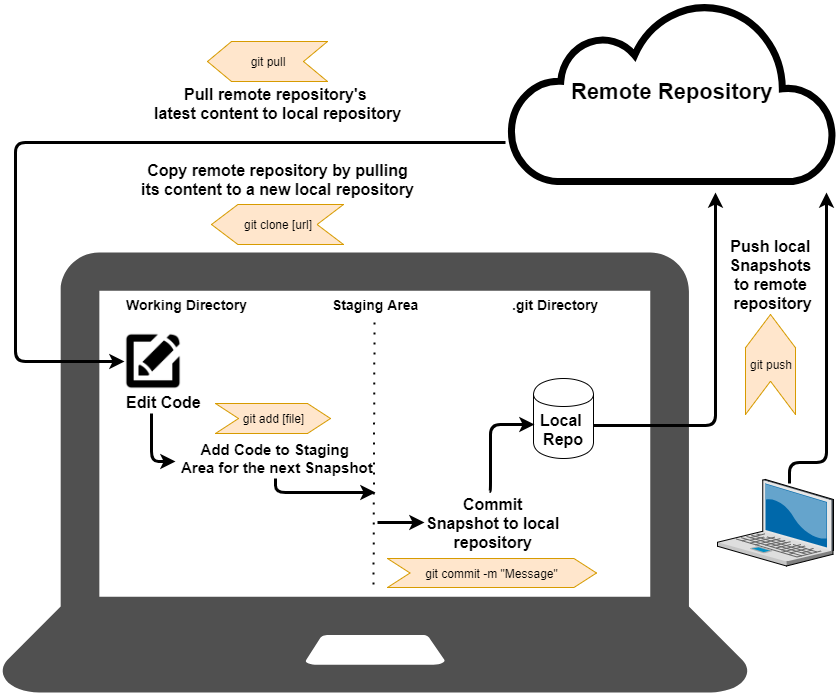
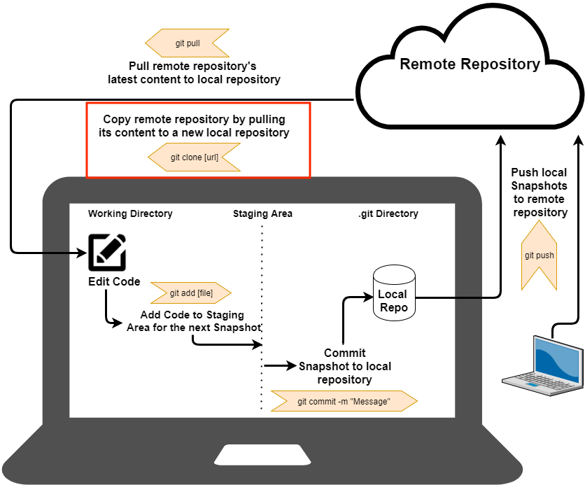
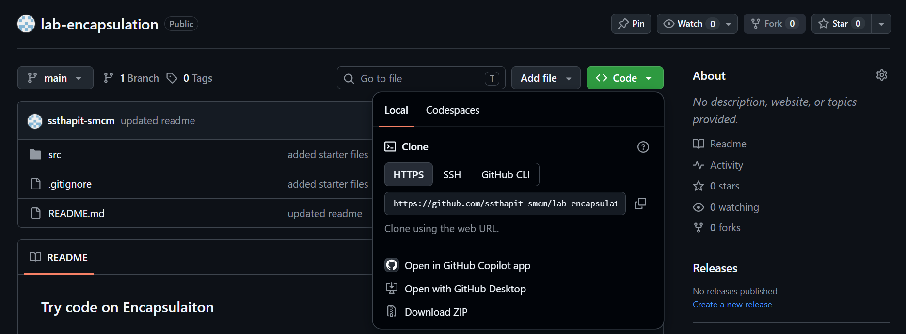
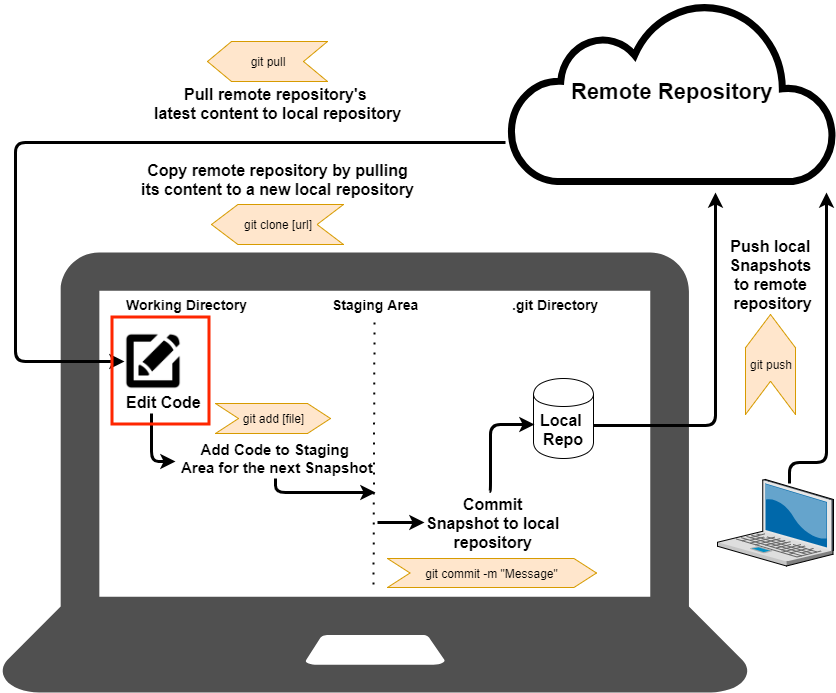
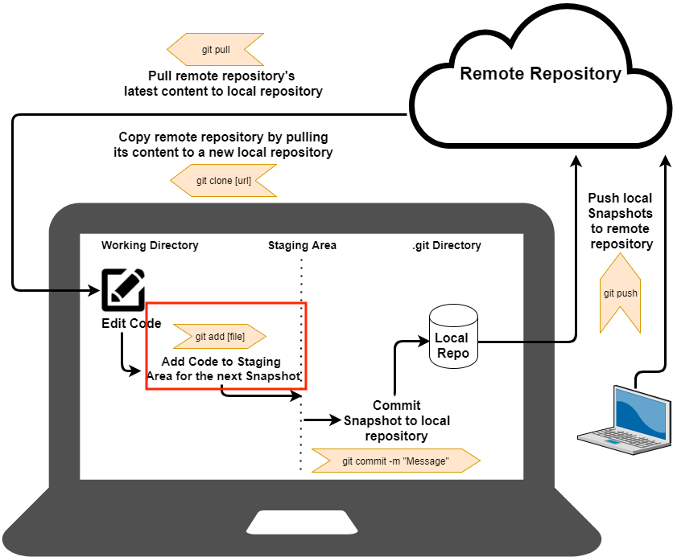
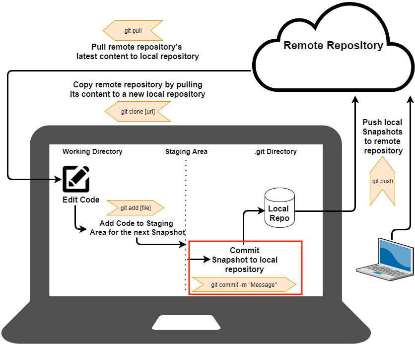
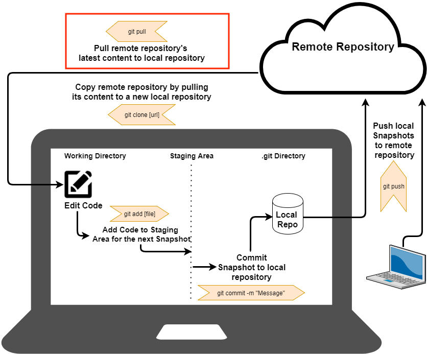
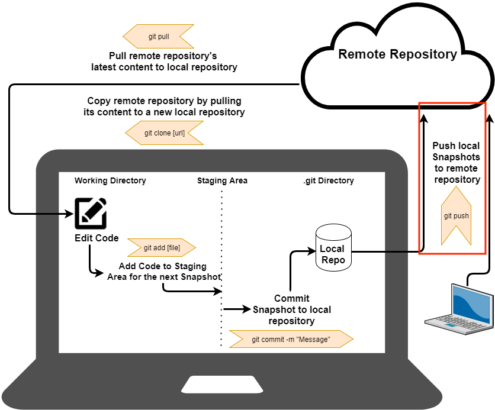
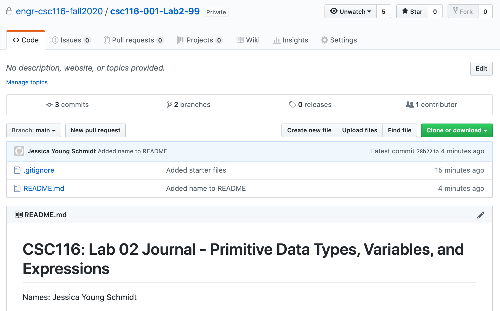

# Tutorial: Using Git for Labs

This tutorial introduces **Git**, a version control system, and walks through the standard Git workflow used on the COSC130 lab computers.

## Prerequisite

The teaching staff has already created a repository for you to clone on GitHub. Before you begin, create a folder to hold all of your future COSC130 repositories:

```terminal
$ cd ~
$ mkdir COSC130
$ cd COSC130
```

---

## 1. Git Introduction

### Git Terminology

A **repository** is where the backup copies of all project files you add to the repository are stored.

- **Local repository** — on your computer
- **Remote repository** — shared repository in the cloud

A **revision** is a snapshot of a project at one moment in time.

- **commit** creates a new revision in the local repository
- **push** copies the revision to the remote repository

### What Is Git?

Other version control systems (like Subversion or CVS) treat information as a set of *files* and *changes made to each file* over time. Git instead treats data as a set of *snapshots*: every time you commit, Git "takes a picture" of your files at that moment and stores a reference to that snapshot. Because the entire history of your project lives in your local repository, you can keep writing code and committing even while offline — once you're back online, you push your history of commits to your remote repository on GitHub.

> **Reminder — Git Paradigm:** Git (generally) only *adds* data. After you commit a snapshot into Git, it is very difficult to lose. This means you can experiment and write code without losing all of your work!

### The Three States of Code Files in Git

- **Modified** — you've changed a file but haven't committed it yet.
- **Staged** — you've marked a modified file to go into your next commit snapshot.
- **Committed** — the snapshot is safely stored in your local Git repository.

### The Three Sections of a Git Project

- **Staging area** (a.k.a. the **"index"**) — stores information about what will go into your next snapshot.
- **Working directory** — a single checkout of one snapshot of your repository's contents, extracted to disk for you to use or modify.
- **.git directory (repository)** — where Git stores the metadata and object database for your project; this is what gets copied when you clone a repository.

### Basic Git Workflow

1. In a text editor, **modify** code in your workspace.
2. **Stage** the code files, adding them to your staging area for the next commit snapshot.
3. **Commit**, taking a snapshot of the staged files and storing it permanently in your local Git repository.
4. **Pull** remote repository data into your local repository (merging conflicts if necessary).
5. **Push** your local repository data to the remote GitHub repository so teammates can pull it.



---

## 2. Git Overview

### Get Contents of a Remote Repo into Your Local Repo

**No local repo yet?** Clone it. From the directory where you want the local repo placed (e.g., `~/COSC130`):

```terminal
$ git clone <URL>
```

**Already have a local repo?** Pull it. From within the local repo directory (e.g., `~/COSC130/lab-encapsulation`):

```terminal
$ git pull
```

### Edit Contents Locally

Use your text editor (e.g., Atom) to edit files in your working directory.

### Send Changes to the Remote Repo

After creating and editing files, add them to the staging area, commit to the local repo, and push to the remote repo:

```terminal
$ git add .
$ git commit -m "<Message about changes>"
$ git push
```

### Check Your Status

From within the local repo directory, you can always run `git status` to see your current status and list of modified files.


---

## 3. First-Time Configuration

Configure Git once on the lab computers to streamline future use. Use your official course username and email — pushes made under a different identity (e.g., your personal computer's name or an unrelated GitHub account) may trigger an academic integrity investigation.

### Creating a Git Identity

Your identity is saved as part of every commit you make. Set it with `git config`:

1. Open the terminal window.
2. Run the following commands:

   ```terminal
   git config --global user.name "Your Name"
   git config --global user.email yourUsername@example.com
   ```

3. Double-check your settings:

   ```terminal
   git config user.name
   git config user.email
   ```

   The name and email you set globally should be returned.


> **Tool — Text Editing with Git (optional):** Git sometimes opens a text editor called **Vi** and waits for you to save before continuing. To exit Vi, hit `ESC`, type `:q`, then press `Enter`.
>
> You can also change the default text editor in Git. For example, to use Visual Studio Code:
>
> ```terminal
> $ git config --global core.editor "code --wait"
> ```

---

## 4. Cloning a Repository



If a remote Git repository already exists (for example, on GitHub), you can get a copy of it locally. Cloning pulls down **every version of every file** in the repository's history to your local `.git` directory.

### Getting the Repository URL for HTTPS

Click the green **"Clone or Download"** button on the repository page. In the popup, make sure **"Clone with HTTPS"** is shown in the top-left corner (click **"Use HTTPS"** if it isn't). Then copy the URL.



### Cloning Your Repository Through the Terminal

> **`git clone` in practice:** The `git clone` command creates a new project directory, initializes a `.git` directory inside it, pulls down all data from the remote repository, and checks out a working copy of the latest version of the files.

Open a terminal, browse to your `COSC130` folder, and run:

```terminal
$ cd ~/COSC130
$ git clone <URL>
```

where `<URL>` is the URL you copied from your GitHub repository.

**Example — cloning with HTTPS:**

```terminal
$ cd ~/COSC130
$ git clone https://github.com/ssthapit-smcm/lab-encapsulation.git
Cloning into 'lab-encapsulation'...
remote: Enumerating objects: 3, done.
remote: Counting objects: 100% (3/3), done.
remote: Total 3 (delta 0), reused 0 (delta 0), pack-reused 0
Unpacking objects: 100% (3/3), done.
$ cd lab-encapsulation
$ ls -a
.		..		.git		.gitignore	README.md
```

### Cloning Outcome

Running `git clone` inside your `COSC130` directory creates a new folder named `lab-encapsulation` — the shared repository the whole class will use for lab work. Your directory hierarchy should now look like:

```text
COSC130                  [a directory containing one or more of your Git repositories]
 -> lab-encapsulation             [the shared lab-encapsulation repository]
    -> Any files that were in the pulled repository
    -> .git              [may be a hidden folder, depending on your OS]
```

---

## 5. Working With Your Cloned Repository



Open the files in your repository folder and edit them directly.

**If working on a project repo:**

1. Open `README.md`.
2. On a new line, enter your name.
3. Save the file and close the text editor.

```text
# cosc130-000-P1-01

Names: Sandeep Sthapit
```

**If working on the shared `lab-encapsulation` repo** (rather than individual lab repos, this course uses one shared `lab-encapsulation` repository for lab work):

1. Open `README.md`.
2. Add your name to the file, replacing `[ENTER NAME HERE]` with your name (you don't need to keep the brackets).
3. Save the file and close the text editor.

```text
# COSC-130: Lab Demo Journal - Primitive Data Types, Variables, and Expressions

Names: Sandeep Sthapit
```

---

## 6. Git Add — Adding Files to the Staging Area



At any moment, files in your project are either **tracked** or **untracked** by Git.

> **Best Practice — Changes in Staged Files:** When you add a file to your staging area, you're adding a *snapshot* of the file at that moment. If you edit the file again before committing, you'll need to re-add it to capture the latest version!

> **Conceptual Knowledge — Tracked and Untracked Files:**
> - A **tracked** file was in the last snapshot. It can be unmodified, modified, or staged.
> - An **untracked** file is everything else — any file in your working directory that wasn't in your last snapshot or your staging area.

To add a specific file to your staging area:

```terminal
$ git add [filename]
```

To add all files in the project to your staging area:

```terminal
$ git add .
```

**Example:**

```terminal
$ git add .
$ git status
On branch main
Your branch is up-to-date with 'origin/main'.
Changes to be committed:
  (use "git reset HEAD <file>..." to unstage)

	modified:   README.md
```

---

## 7. Git Status — Checking Repository Status

Once you have a freshly cloned repository with files you've created or copied in, you can check how Git sees them:

```terminal
$ git status
On branch main
Your branch is up-to-date with 'origin/main'.
Changes not staged for commit:
  (use "git add <file>..." to update what will be committed)
  (use "git checkout -- <file>..." to discard changes in working directory)

	modified:   README.md

no changes added to commit (use "git add" and/or "git commit -a")
```

---

## 8. Git Commit — Recording a Snapshot



Once your files are staged, record a snapshot of your changes with `git commit`.

> **Reminder — How Often Should I Commit?** Commit often — each time your project reaches a state you want to record.

> **Conceptual Knowledge — Commit Messages:** Always include a meaningful, descriptive commit message summarizing what changed since the last snapshot. See the Pro Git Book for guidance on writing good commit messages.

> **Reminder — Files Included in Your Commit:** Anything not in your staging area will **not** be part of your commit! Unstaged files remain modified on disk.

Basic usage:

```terminal
git commit -m "provide a commit message summarizing the changes you have made to your code"
```

As a shortcut, you can skip staging for already-tracked files with the `-a` flag (it automatically stages a snapshot of all tracked files):

```terminal
git commit -am "descriptive commit message"
```

> **Reminder — The `-a` Flag:** With `-a`, you don't need to manually `git add` unstaged files first.

**Example:**

```terminal
$ git commit -m "Added name to README"
[main 78b221a] Added name to README
 1 file changed, 1 insertion(+), 1 deletion(-)
$ git status
On branch main
Your branch is ahead of 'origin/main' by 1 commit.
  (use "git push" to publish your local commits)
nothing to commit, working tree clean
```

Notice that `git status` now shows the local repository is **ahead** of the remote — meaning it has more recent changes than the remote. You'll need to push to catch the remote up.

---

## 9. Git Pull — Updating Your Local Repository



You'll need to pull in at least three situations:

- Your computer fails and you need to retrieve a backup of your project.
- You want to work on the project from a different computer.
- You're working with a partner or team on the same project.

> **Best Practice — Collaboration in Git:** When working on a team, always pull the latest code from the remote repository before making new changes. This reduces the number of conflicts you'll need to merge later.

`git pull` automatically **fetches** and **merges** remote repository contents into your current working directory. For COSC130, the default branch name is `main`.

```terminal
git pull [shortname] [branchname]
```

**Example:**

```terminal
$ git pull
remote: Enumerating objects: 5, done.
remote: Counting objects: 100% (5/5), done.
remote: Compressing objects: 100% (3/3), done.
remote: Total 3 (delta 1), reused 0 (delta 0), pack-reused 0
Unpacking objects: 100% (3/3), done.
From https://github.com/ssthapit-smcm/lab-encapsulation.git
   78b221a..4c0d1b5  main       -> origin/main
Updating 78b221a..4c0d1b5
Fast-forward
 README.md | 4 ++--
 1 file changed, 2 insertions(+), 2 deletions(-)
```

---

## 10. Git Push — Sending Commits to the Remote Repository



When your project is in a good state and you want to send your local commit snapshots to your remote GitHub repository, push your changes.

> **Reminder — Check Your Submission:** After pushing, always visit your GitHub repository to confirm the files are actually there.

To see the remote repositories currently configured:

```terminal
$ git remote -v
origin	https://github.com/ssthapit-smcm/lab-encapsulation.git (fetch)
origin	https://github.com/ssthapit-smcm/lab-encapsulation.git (push)
```

The `-v` flag shows the URLs Git has stored for each remote. Here, the "short name" for the repository is `origin` — the default when you clone (unless you specify otherwise). In COSC130, you typically won't need to worry about this.

To push your local commits:

```terminal
git push [shortname] [branchname]
```

For COSC130, `[branchname]` defaults to `main`, so `git push` alone is usually enough.

**Note for first time pushing**
Set up credentials so that you do not have to input password every single time:

   ```terminal
   git config --global credential.helper manager
   ```
```terminal


Then do a git push, it should pop up a login window, you're done.

**Example:**

```terminal
$ git push
Counting objects: 3, done.
Delta compression using up to 4 threads.
Compressing objects: 100% (3/3), done.
Writing objects: 100% (3/3), 355 bytes | 0 bytes/s, done.
Total 3 (delta 1), reused 0 (delta 0)
remote: Resolving deltas: 100% (1/1), completed with 1 local object.
To https://github.com/ssthapit-smcm/lab-encapsulation.git
   e14a14a..78b221a  main -> main
```

If successful, your updated `README.md` will appear on the remote repository.



---

## 11. .gitignore — Ignoring Files You Don't Want to Push

> **Conceptual Knowledge — Git Ignore Rules:**
> - Blank lines, or lines starting with `#`, are ignored.
> - Standard pattern-matching works in `.gitignore` files:
>   - `*` matches zero or more characters
>   - `[abc]` matches any character inside the brackets
>   - `?` matches a single character
>   - `[0-9]`-style brackets match any character in that range
>   - `**` matches nested directories, e.g. `/projectName/**/Main.java`
> - Start a pattern with `/` to avoid recursion.
> - End a pattern with `/` to indicate a directory.
> - Negate a pattern by starting it with `!`.

A good starting-point `.gitignore` for this course:

```text
# This rule ignores class files
*.class

# This rule ignores the contents of the bin/ build output directory (which includes .class files)
bin/

# This rule ignores temporary files that end with ~
*~

# This rule ignores the contents of the .settings directory that text editors will sometimes make
.settings/

# This rule ignores .DS_Store on Macs
**/.DS_Store

# This rule ignores VS Code directory
**/.vscode
```

Since `.class` files (and other build output) are regenerated whenever you build your `.java` files, you don't need to commit them. Similarly, some operating systems and applications generate temporary files ending in `~` (for example, Microsoft Word creates a temporary file until you save and close a document).

Create your `.gitignore` file in your text editor and save it in your repository directory.

---

## 12. Wrap Up

This tutorial only scratched the surface of Git. Moreover, I will upload course lectures to Git, so you can clone this repository: https://github.com/ssthapit-smcm/COSC130-Course.git

### What Makes GitHub Useful

- **Version Control** — Git keeps a full history of your files, so restoring a previous version is easy.
- **Work Everywhere** — store projects remotely and access them from any device: clone, work, push, and stay in sync across machines.
- **Teamwork** — teams can collaborate on the same repository, including open-source contributions.
- **Portfolio** — GitHub serves as a professional portfolio for developers, similar to a photographer's portfolio.
- **Project Management, Organization, and Analysis** — each repository has an "Issues" tab for tracking planned or in-progress work, a "Settings" page for adding collaborators, and Wiki pages for documentation.
- **Student Developer Pack** — students can sign up for GitHub's Student Developer Pack for free access to professional software tools.

For more advanced topics — like branching and merging — see the official Git documentation.

If you want to learn more, you can check out [Learn Git Branching](https://learngitbranching.js.org/?locale=en_US)