## Encapsulation

 - What is Encapsulation?
    - Hiding the implementation details of an object from the clients of the object
 - Why Use Encapsulation?
   - Protects data from unwanted access
   - Clients cannot directly access of modify its internal workings – nor do they need to do so
   - Encapsulation leads to abstraction
   - Can later change the internal workings of the class without modifying client code

---


### Learning Goals

 - Handling Exceptions (try catch)
 - Object Oriented Design
 - Choosing Classes
 - UML

---


# Exception Handling

---

Imagine that we order a product online, but while en-route, there’s a failure in delivery. A good company can handle this problem and gracefully re-route our package so that it still arrives on time.

Likewise, in Java, the code can experience errors while executing our instructions. Good exception handling can handle errors and gracefully re-route the program to give the user still a positive experience.

---

Exception handling in Java is a mechanism used to handle exceptional conditions that occur during program execution. It helps prevent the program from terminating unexpectedly and allows developers to provide appropriate recovery or error-handling logic.

- Separates error-handling code from normal program logic.
- Helps maintain the normal flow of program execution.


## Java Exception Hierarchy

In Java, all exceptions and errors are subclasses of the `Throwable` class. It has two main branches:

1. `Exception`
2. `Error`

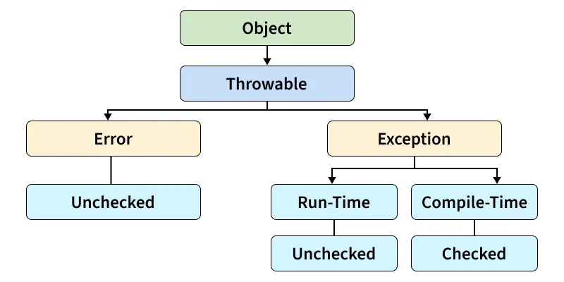

## Types of Java Exceptions

Java defines several types of exceptions that relate to its various class libraries. Java also allows users to define their own exceptions.

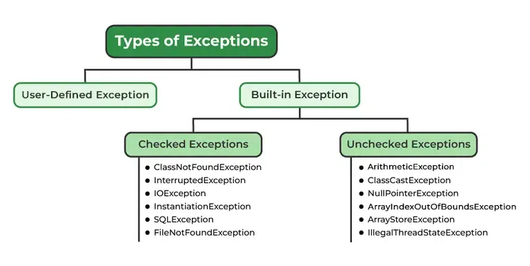

### 1. Built-in Exception

Built-in exceptions are pre-defined exception classes provided by Java to handle common errors during program execution. There are two types of built-in exceptions in Java:

- **Checked Exception:** These exceptions are checked at compile time, forcing the programmer to handle them explicitly.
- **Unchecked Exception:** These exceptions are checked at runtime and do not require explicit handling at compile time.

## Unchecked Exceptions

Unchecked exceptions are exceptions that are not checked by the compiler at compile time. They occur during program execution and usually result from programming errors or incorrect logic.

- They are subclasses of RuntimeException.
- Handling them is optional and not enforced by the compiler.

### Commonly Occurred Unchecked Exceptions

- `NullPointerException`: Occurs when attempting to access a method or field on a null reference.
- `ArithmeticException`: Thrown for illegal arithmetic operations, such as division by zero.
- `ArrayIndexOutOfBoundsException`: Occurs when accessing an array with an invalid index.
- `StringIndexOutOfBoundsException`: Thrown when a string is accessed using an invalid index.
- `NumberFormatException`: Occurs when converting an invalid string to a numeric type.
- `ClassCastException`: Thrown when an object is cast to an incompatible type.

---

Consider the following Java program. It compiles fine, but it throws an `ArithmeticException` when run. The compiler allows it to compile because `ArithmeticException` is an unchecked exception.

```java
class Geeks {
    public static void main(String args[]) {

        // Here we are dividing by 0 which will not be caught at compile time
        // as there is no mistake, but caught at runtime because it is
        // mathematically incorrect
        int x = 0;
        int y = 10;
        int z = y / x;
    }
}
```

**Output:**

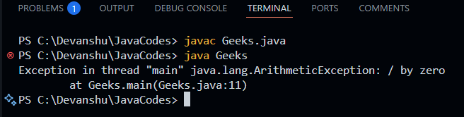

**Explanation:** The program compiles successfully because `ArithmeticException` is an unchecked exception. However, when the program runs, dividing 10 by 0 throws an `ArithmeticException`.

---

> **Note:**
>
> - Unchecked exceptions are runtime exceptions that are not required to be caught or declared in a `throws` clause.
> - These exceptions are caused by programming errors, such as attempting to access an index out of bounds in an array or attempting to divide by zero.

---


### 2. User-Defined Exception

Sometimes the built-in exceptions in Java are not able to describe a certain situation. In such cases, users can create their own exceptions, called "user-defined exceptions".


## Basic try-catch

- The `try` block contains code that might throw an exception.
- The `catch` block handles the exception if it occurs.

```java
class Demo {
    public static void main(String[] args) {

        int n = 10;
        int m = 0;

        try {
            int ans = n / m;
            System.out.println("Answer: " + ans);
        } catch (ArithmeticException e) {
            System.out.println("Error: Division by 0!");
        }
    }
}
```

**Output**

```
Error: Division by 0!
```

**Explanation:** The division operation throws an `ArithmeticException`. The matching `catch` block catches the exception and prints an appropriate message instead of allowing the program to terminate abruptly.

## Finally Block

The `finally` block is used to execute cleanup code after `try` and `catch`. It normally executes whether an exception occurs or not. `finally` may not execute in cases like:

- `System.exit()`
- JVM crash
- an infinite loop before `finally`

```java
class FinallyExample {
    public static void main(String[] args) {

        int[] numbers = {1, 2, 3};

        try {
            System.out.println(numbers[5]);
        } catch (ArrayIndexOutOfBoundsException e) {
            System.out.println("Exception caught.");
        } finally {
            System.out.println("Finally block executed.");
        }

        System.out.println("Program continues...");
    }
}
```

**Output**

```
Exception caught.
Finally block executed.
Program continues...
```

## throw and throws Keywords

**throw:** Used to explicitly throw a single exception.

**Syntax:**

```java
throw new ExceptionType("message");
```

**Output:**

```
Exception in thread "main" java.lang.IllegalArgumentException: Age must be 18 or above
    at Demo.checkAge(Demo.java:5)
    at Demo.main(Demo.java:11)
```

---


**throws:** The `throws` keyword is used in a method declaration to indicate that the method may throw one or more exceptions.

**Syntax:**

```java
returnType methodName() throws ExceptionType {
    // Code
}
```

---

```java
class Demo {

    /**
     * Calculates the area of a rectangle.
     *
     * @param length the length of the rectangle; must not be negative
     * @param width  the width of the rectangle; must not be negative
     * @return the calculated area (length * width)
     * @throws IllegalArgumentException if length or width is negative
     */
    static double calculateArea(double length, double width) throws IllegalArgumentException {

        if (length < 0 || width < 0) {
            throw new IllegalArgumentException("Length and width must not be negative.");
        }

        return length * width;
    }

    /**
     * main method
     *
     * @param args command-line arguments
     */
    public static void main(String[] args) {

        try {
            double area = calculateArea(-5, 10); // Negative length triggers the exception
            System.out.println("Area: " + area);
        } catch (IllegalArgumentException e) {
            System.out.println("Invalid input: " + e.getMessage());
        }

        System.out.println("\nProgram continues after area calculation.");
    }
}
```

---

**Output**

```
Invalid input: Length and width must not be negative.

Program continues after area calculation.
```

### We can keep asking for valid inputs

import java.util.Scanner;

class Demo {

    /**
     * Calculates the area of a rectangle.
     *
     * @param length the length of the rectangle; must not be negative
     * @param width  the width of the rectangle; must not be negative
     * @return the calculated area (length * width)
     * @throws IllegalArgumentException if length or width is negative
     */
    static double calculateArea(double length, double width) throws IllegalArgumentException {

        if (length < 0 || width < 0) {
            throw new IllegalArgumentException("Length and width must not be negative.");
        }

        return length * width;
    }

    /**
     * main method
     *
     * @param args command-line arguments
     */
    public static void main(String[] args) {

        Scanner scanner = new Scanner(System.in);
        boolean validInput = false;

        while (!validInput) {
            System.out.print("Enter length: ");
            double length = scanner.nextDouble();

            System.out.print("Enter width: ");
            double width = scanner.nextDouble();

            try {
                double area = calculateArea(length, width);
                System.out.println("Area: " + area);
                validInput = true; // success, exit the loop
            } catch (IllegalArgumentException e) {
                System.out.println("Invalid input: " + e.getMessage());
                System.out.println("Please try again.\n");
            }
        }

        System.out.println("\nProgram continues after area calculation.");
        scanner.close();
    }
}

---

**Output**

```
Enter length: -5
Enter width: 10
Invalid input: Length and width must not be negative.
Please try again.

Enter length: 4
Enter width: 6
Area: 24.0

Program continues after area calculation.
```

---

**Internal Working of try-catch Block:**

- The JVM executes code inside the `try` block.
- If an exception occurs, the remaining `try` code is skipped and the JVM searches for a matching `catch` block.
- If found, the `catch` block executes.
- Control then moves to the `finally` block (if present).
- If no matching `catch` is found, the exception is handled by the JVM's default handler.
- The `finally` block always executes, whether an exception occurs or not.

> **Note:** When an exception occurs and is not handled, the program terminates abruptly and the code after it will never execute.

---

### Nested try-catch

In Java, you can place one try-catch block inside another to handle exceptions at multiple levels.

```java
public class NestedTryExample {
    public static void main(String[] args) {
        try {
            System.out.println("Outer try block");
            try {
                int a = 10 / 0; // This causes ArithmeticException
            } catch (ArithmeticException e) {
                System.out.println("Inner catch: " + e);
            }
            String str = null;
            System.out.println(str.length()); // This causes NullPointerException
        } catch (NullPointerException e) {
            System.out.println("Outer catch: " + e);
        }
    }
}
```

---

**Output**

```
Outer try block
Inner catch: java.lang.ArithmeticException: / by zero
Outer catch: java.lang.NullPointerException: Cannot invoke "String.length()" because "<local1>" is null
```

**Explanation:** The inner `try-catch` handles the `ArithmeticException`. Later, the outer `try` encounters a `NullPointerException`, which is handled by the outer `catch`.

### Handling Multiple Exceptions

We can handle multiple types of exceptions in Java by using multiple `catch` blocks, each catching a different type of exception.

## Methods to Print the Exception Information

- printStackTrace(): Prints the full stack trace of the exception, including the name, message, and location of the error.
- toString(): Prints exception information in the format of the name of the exception.
- getMessage(): Prints the description of the exception.


---

### Example:

class Demo {

    static int divide(int numerator, int denominator, int[] arr, int index) {
        return arr[index] / denominator;
    }

    public static void main(String[] args) {

        int[] numbers = {10, 20, 30};

        try {
            int result = divide(0, 0, numbers, 5); // bad index AND division by zero
            System.out.println("Result: " + result);
        } catch (ArrayIndexOutOfBoundsException e) {
            System.out.println("Array error: " + e.getMessage());
        } catch (ArithmeticException e) {
            System.out.println("Math error: " + e.getMessage());
        } catch (Exception e) {
            System.out.println("Some other error occurred: " + e.getMessage());
        }

        System.out.println("\nProgram continues after division.");
    }
}

---

# Object Oriented Design

---

## Object-Oriented Design

- Describes: **classes**, their **state/behaviors**, and **relationships** between classes
- Process:
  1. Discover classes and their state
  2. Determine responsibilities of each class
  3. Describe relationships between classes

---


## Class Diagrams

- A type of **UML diagram**
- Analyzing requirements:
  - **Nouns** → possible objects / object state
  - **Verbs** → possible class behaviors
- Goal: represent each class as a **single responsibility**, plus relationships between classes

---

**Supporting Tools (UML Editors)**


 - [Dia](http://dia-installer.de/)
 - [UMLetino](http://www.umlet.com/umletino/umletino.html)
 - [PlantUML](http://plantuml.com/)
 - **[Draw.io](https://www.draw.io/)**

---

## Anatomy of a Class (UML Box)

Three stacked sections:


1. **Class name** (+ package name, sometimes)
2. **Fields / state**
3. **Behaviors / methods**

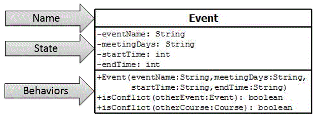

---

## Visibility Symbols

| Symbol | Meaning | Who can access |
|---|---|---|
| `+` | public | any class |
| `-` | private | no external class |
| `#` | protected | subclasses & same package |
| *(none)* | default | same package only |

---

## Reading a Field / Method

- Format: `visibility name : type`
- Method: `visibility name(param: type) : returnType`
  - Return type = what the method can be treated as in code
- **Static** field/method → underlined
- **Final** field → no special notation

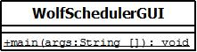

---

#### Composition (has-a)

- A **composition relationship** = one class has/uses an instance of another class
- Modeled with different connectors depending on relationship strength
- Connector is annotated with the **field name** (so no need to list the field again in the class)
- **Multiplicity** shows how many:
  - `1` → single instance
  - `0..*` → many (stored in a collection)

---

#### Association Connector

- Solid line between container and contained
- **Uni-directional**: arrow points to the contained class
  - e.g., `Schedule` has `events` (collection of `Event`)

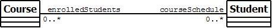


- **Bi-directional**: both classes hold a reference to each other
  - e.g., `Course` has `enrolledStudents` (collection of `Student`)
  - `Student` has `courseSchedule` (collection of `Course`)

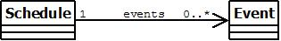

---

#### Aggregation Connector

- Solid line + **open diamond** at the container end
- Models a **whole-part** relationship
- Part **can exist separately** from the whole
- Example: a car *has* wheels — wheel can exist without the car
- Example: `Schedule` *has* `Event`s (if events can exist outside the schedule)

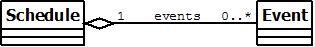

---

#### Composition Connector

- Solid line + **filled diamond** at the container end
- Also a whole-part relationship, but:
  - Part **cannot exist** without the whole
  - Whole controls the part's **entire lifecycle**
- Example: a `Chapter` doesn't exist without an `Book`
- Often used to model **inner classes**

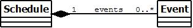

---

#### Dependency Connector

- **Dashed line**, arrow points to the contained class
- Used when a class uses another as a **local variable or parameter** — *not* a field


##  UML Diagrams  


*  UML: Unified Modeling Language

    *  Models object-oriented software
    *  Convergence from three earlier modeling languages

        *  OMT (James Rumbaugh)
        *  OOSE (Ivar Jacobson)
        *  Booch (Grady Booch)


*  Overseen by the Object Mentor Group (OMG):<br> ([www.omg.org](www.omg.org){:target="_blank"})
*  Access modifiers

    *  `-`: private
    *  `+`: public


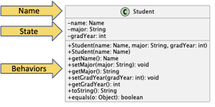
 

##  Class Design  
(References: (1) A. Riel, *Object-Oriented Design Heuristics*, 1996. and (2) S. Reges and M. Stepp, *Building Java Programs: A Back to Basics Approach*, 3rd Edition.)


*  Do not provide any functionality that does not have a clear use
*  Omit mutators that have no use
*  Limit object creation to the constructor
*  "Classes should be immutable unless there’s a very good reason to make them mutable... If a class cannot be made immutable, limit it’s mutability as much as possible."  - Joshua Bloch
*  Classes should have cohesion

    *  The extent to which the code for a class represents a single abstraction
    *  Allows for reusability of the class in other programs
    *  For example

        *  The `Book` class represents only things a book can do and knows.
        *  A `Book` should not perform console input and output


*  Classes should not have unnecessary dependencies

    *  Coupling is the degree to which one part of a program depends on another
    *  Related data and behavior should be in the same place (same class)


 

##  Principles of Object-Oriented Programming  

(Reference: R. Bravaco and S. Simonson, *Java Programming: From the Ground Up*, 1st edition.)

*Problem Statement*


*   Need to make important design decisions prior to attempting to implement.
*   "Usually, there is no single best set of classes for a particular application, and hence you should not look for the ‘right answer’; however, some designs are better than others."
*   "Program design is not linear, it is iterative.”


*Simple Design Process*


*  Determine the classes.
*  Determine the responsibilities of each class.
*  Determine the interactions and collaborations among the classes.


 

*Determine the Classes*


*  "Just as a noun is a person, place, or thing, so is an object.”
*  Begin by noting the nouns in the problem statement.
*  These nouns give us a good starting point for considering possible classes.

    *  Not all nouns will become classes
    *  Not all classes will correspond to nouns of problem statement.


* Determine Responsibilities of Each Class*


*  "As the nouns indicate classes, the verbs of the problem statement help determine class responsibilities.”
*  Consider:

    *  What service does the class provide?
    *  What is each class’s responsibility?
    *  What are the actions and behaviors of each class?
    *  What attributes/fields?


 


##  Interacting Classes  


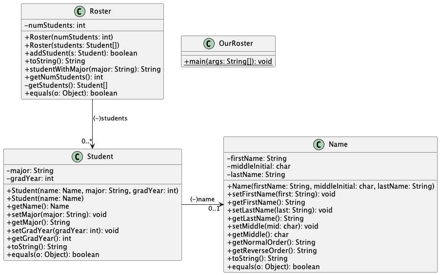

Code: [interacting classes](blackboardlink){:target="_blank"}

---

## Hints & Suggestions

The following are helpful hints for working on your design:

1. Determine the classes that your implementation will use. 
    * Begin by noting the nouns in the requirements/analysis documentation (or problem statement).
    * These nouns give us a good starting point for considering possible classes.
    * Not all nouns will become classes. Some nouns may become attributes/fields (see 3). Other nouns may not become classes or attributes/fields.
    * Not all classes will correspond to nouns of problem statement.
    * Once you have a list of possible classes, consider different design options along with the pros and cons of each. We often do not come up with the best design on our first attempt.
2. Determine the methods for each class. 
    * "As the nouns indicate classes, the verbs of the problem statement help determine class responsibilities."
    * Consider:
        * What service does the class provide?
        * What is each class’s responsibility?
        * What are the actions and behaviors of each class?
        * What attributes/fields used in the methods?
    * Not all verbs will become methods.
    * Not all methods will correspond to verbs in the problem statements.
3. Determine the attributes/fields of each class by observing which classes need to send messages to which.
    * Nouns can also help with these
    * Remember, not all nouns will become classes or attributes/fields.
    * Not all attributes/fields will correspond to nouns in the problem statement.
4. Refine your design. Write headers for all methods
5. Then implement the methods. 

---

### Read Chapter 11 

Java Programming From the Ground Up (Chapter 11) pdf in assignment

**Try Assignment 3**


---

### Next Class
 - Inheritance and polymorphism