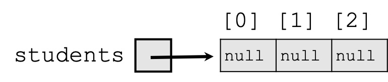
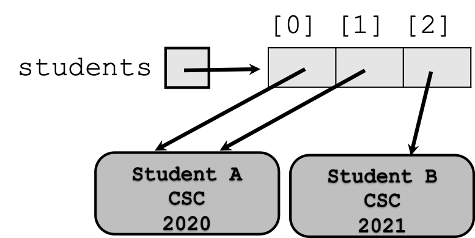

## Quiz Revision

1. What is the output of the following code? (2 pts)
```java
int a = 5;
int b = 7;
int c = 8;
double avg = (a + b + c) / 3;
System.out.println(avg);
```


2. Which Scanner method reads a whole line of input as a String? (1 pt)
 - next() 
 - nextLine()
 - nextInt()
 - nextDouble()

3. Which type of error occurs when code compiles and runs but produces the wrong result? (1 pt)
 - Logic error 
 - Runtime error 
 - Syntax error 

---

4. What is the best primitive type to store the number of items in a shopping cart? (1 pt)
<br>
<br>
<br>
<br>

5. What is the value of (double) 9 / 2? (2 pts)
<br>
<br>
<br>
<br>

6. Evaluate: (3 pts)
`"Total: " + 2 + 3 * 2 + 5`
<br>
<br>
<br>
<br>
<br>
<br>
<br>
<br>


# Objects

---

**What we'll cover:**

    
- What an object is and why we use them.
    
- Classes as blueprints for objects.
    
- Constructors, fields, and instance methods.

---


## The Transition to Objects

So far, we've focused on **procedural programming**. The program is a set of instructions (`main` method) that operates on data (variables).

**Problem:** What happens when our programs get bigger? We end up with long lists of methods that all operate on the same data.

**Solution:** **Object-Oriented Programming (OOP)**. We combine data and the methods that operate on that data into a single unit called an **object**.

---

## What is an Object?

An **object** is a self-contained unit that has **state** and **behavior**.

- **State**: The data or properties of the object. These are stored in **fields** (variables).
    
- **Behavior**: The actions the object can perform. These are defined by **methods**.
    

**Analogy:** A car is an object.

- **State**: Color, make, model, speed.
    
- **Behavior**: `accelerate()`, `brake()`, `turnOn()`.

---

## Classes as Blueprints

A **class** is the blueprint or template for creating objects. It defines the fields and methods that all objects of that type will have. You don't interact with the blueprint directly; you use it to build things.


---

**Analogy:**

- **Class:** The blueprint for a car. It specifies that all cars will have a color, a model, and methods like `accelerate()`.
    
- **Object:** A specific, physical car created from that blueprint (e.g., a "red Ford Mustang"). You can have many objects from the same class, each with its own unique state.

---

## Defining a Class

To define a class, you use the `class` keyword. Inside the class, you declare fields and methods.

```java
public class Dog {
    // Fields (State)
    String name;
    int age;

    // Methods (Behavior)
    public void bark() {
        System.out.println("Woof!");
    }
}
```


This class defines a `Dog` object. Every `Dog` object we create from this blueprint will have a `name`, an `age`, and the ability to `bark()`.

---

### Syntax for Class

Syntax for `<class_name>`.java
```java
public class <class_name> {

}
```


Syntax for Book.java
```java
public class Book {
    
}
```


## Fields

*Object* a programming entity that contains **state**(data) and **behavior**(methods)

- State
    - A set of values (internal data) stored in an object.
    - Represented by *fields* within the class
- Behavior
    - A set of actions an object can perform, often reporting or modifying its internal state.
    - Represented by instance methods within the class

---

**Field**: a variable inside an object that makes up part of its internal state

State-only
```java
public class Book {
    /** Title of the book */
    String title;
    /** Author of the book */
    String author;
    /** Publication year of the book */
    int pubYear;
}
```

*Declaring field is same normal variables: type and name*


**Difference**
 - Directly inside braces of class
 - We’re saying –we want every object of the class to have the variables

---

Fields are given *default initial values* when an object is constructed


Define the *fields at the top of the class* definition


Classes that create instances of your class can access the fields (unless private)

Retrieve value: `book1.title;`
Modify value: `book1.title = "Harry Potter";`

---

### Book Example - Fields

```java
import java.util.Date;
public class Book {
    /** Title of the book */
    String title;
    /** Author of the book */
    String author;
    /** Publication year of the book */
    int pubYear;
    /** Person who has checked out the book */
    String checkedOut;
    /** Location of the book in the stacks */
    int location;
    /** Date a checked out book is due */
    Date dueDate;
}
```

---

## Instance Methods

Methods defined inside a class are called **instance methods**. They operate on the specific object they are called on. They can access the object's fields directly.

```java
public class Dog {
    String name;

    public void bark() { // An instance method
        System.out.println(name + " says woof!");
    }
}

// In main:
Dog myDog = new Dog("Fido", 3);
myDog.bark(); // Output: Fido says woof!
```

When `myDog.bark()` is called, the `bark()` method knows to use `myDog`'s `name` field.

---

## Static Methods vs. Instance Methods

This is a common point of confusion.

- **Static Methods (`static`)**: Belong to the **class**, not a specific object. You call them using the class name (e.g., `Math.random()`). They **cannot** access instance fields.
    
- **Instance Methods (no `static`)**: Belong to a specific **object**. They can access the object's fields and methods. You must have an object to call them (e.g., `myDog.bark()`).

---

## The `toString()` Method

The `toString()` method is a special instance method that returns a `String` representation of an object. It's often used for debugging or printing objects.

- **Default behavior**: It prints a gibberish-looking string (e.g., `Dog@765f33f0`).
    
- **Good practice**: *Override* the `toString()` method to provide a meaningful string.
    

**Example:**

```java
@Override // This annotation is good practice
public String toString() {
    return "Dog[name=" + name + ", age=" + age + "]";
}
```

---

## The `toString()` in Action

Now, when you try to print your object, you get a clean output.

```java
Dog myDog = new Dog("Fido", 3);

System.out.println(myDog);
// Output: Dog[name=Fido, age=3]
```

The `println()` method automatically calls `toString()` if you pass it an object.

---

## Exercise: Creating a `Transaction` Class

Let's do a quick exercise to refresh these concepts.

**Problem:** Create a class called `Transaction`.

- It should have fields for `description` (String), `date` (String), and `amount` (double)
    
- override the `toString` method to display the transaction information in a clear format.

---

## Creating an Object

You create an object from a class using the `new` keyword. This is also called **instantiating** an object.

**Syntax:** `ClassName objectName = new ClassName();`

**Example:**

```java
Dog myDog = new Dog();
```

- `myDog` is an **object variable** that holds a reference to a new `Dog` object.
    
- The `new Dog()` part creates the new object in memory.

---

## Accessing an Object's Fields and Methods

You use the **dot operator (`.`)** to access an object's fields and methods.

**Example:**

```java
Dog myDog = new Dog();

// Set the state of the object
myDog.name = "Fido";
myDog.age = 3;

// Call a method on the object
myDog.bark(); // Output: "Woof!"

System.out.println(myDog.name + " is " + myDog.age + " years old.");
// Output: "Fido is 3 years old."
```

---

## Exercise - creating a `Course` class

- Create a `Course` class with the `string` fields `code` and `title`. 
- Add a method called `print()` to print these fields.
- Create an object and assign the values `"COSC130"`, and `"INTRO TO COMPUTER SCIENCE II"` to the `code` and title `respectively`.
- Call the `print()` method of the object to print these fields.

---

## Constructors

A **constructor** is a special method used to **initialize** a new object. It's called automatically when you use the `new` keyword.

- A constructor has the same name as the class.
    
- It has **no return type** (not even `void`).

---

**Example:**

```java
public class Dog {
    String name;
    int age;

    // Constructor
    public Dog(String dogName, int dogAge) {
        name = dogName;
        age = dogAge;
    }
}
```

---

## Using a Constructor

Now, when we create a `Dog` object, we can provide the initial values directly.

```java
// Create a Dog object using the constructor
Dog myDog = new Dog("Fido", 3);

System.out.println(myDog.name); // Output: Fido
```

This is a much cleaner way to create and set up an object.

---

## The Default Constructor

If you don't provide any constructor, Java creates a **default constructor** for you. It's a constructor with no parameters that doesn't do anything.

```java
public class Dog {
    // No constructor defined
    String name;
}

// In main:
Dog myDog = new Dog(); // This works!
```

But once you create your own constructor, the default constructor is **no longer available**.

---

## `this` Keyword

Inside a class, the **`this` keyword** refers to the current object. It's often used to distinguish between a parameter and a field that have the same name.

**Example:**

```java
public class Dog {
    String name;
    int age;

    public Dog(String name, int age) {
        this.name = name; // refers to the object's name
        this.age = age;   // refers to the object's age
    }
}
```

This makes the code more concise and readable.

---


## Review of Object Concepts

- **Class**: The blueprint.
    
- **Object**: An instance of a class.
    
- **Fields**: The data (state) of an object.
    
- **Methods**: The actions (behavior) of an object.
    
- **Constructor**: A special method to create and initialize an object.
    
- **`new`**: The keyword used to create an object.
    
- **`this`**: Refers to the current object.
    
- **Dot operator (`.`)**: Used to access an object's fields and methods.

---


## Exercise: Creating a `Student` Class

Let's do a quick exercise to refresh these concepts.

**Problem:** Create a class called `Student`.

- It should have fields for `studentName` (String), `major` (String), and `gradYear` (int)

- create constructor to initialize the fields

- override the `toString` method to display the "<studentName> is majoring in <major> and will graduate in <gradYear>".

---


## Passing Objects to Methods

You can pass objects to methods as arguments. This is a powerful way to share and manipulate data.

**Example:**

```java
public void giveShot(Dog dog) { 
	System.out.println(dog.name + " got a shot!"); 
}

public static void main(String[] args) {
    Vet myVet = new Vet();
    Dog myDog = new Dog("Fido", 3);
    myVet.giveShot(myDog); // Passing the myDog object
}
```


# Array of Objects

---

###  Student Object  

Student stores student name, major, and graduation year.


*  Must be constructed using the new keyword

```java
Student <name> = new Student(<student_name>, <major>, <grad_year>);
```

*  Example:

```java
Student studentA = new Student("Student A", "COSC", 208);
```

 ---

##  Array of Objects  


```java
Student[] students = new Student[3];
```





 
--- 

##  `null`  


It is legal (will not throw an exception) to:

*  store `null` in a variable or array element (often as a dummy value, an initial value to be overwritten later)

```java
String s = null;
words[2] = null;
```

*  print a `null` reference

```java
System.out.println(s);   // will print: null
```

*  ask whether a variable or array element is `null`

```java
if (words[i] == null) { ... } 
```

*  pass `null` as a parameter to a method
*  return `null` from a method (often as an indication of failure, such as a method that searches for an object in a file/array but does not find it)


 ---


##  `NullPointerException`  


It is not legal to dereference a `null`  value (trying to access any of its methods or data using . (dot) notation)

Since `null`  is not an actual object, it has no methods or data. Trying to access them crashes your program.


```java
public class ExampleNull {

    public static void main(String[] args) {
        String[] words = new String[5];
        System.out.println("word 0 is: " + words[0]);
        words[0] = words[0].toUpperCase(); // bad
        System.out.println("word 0 is now: " + words[0]);
    }

}
```


```terminal
$ java -cp bin ExampleNull
word 0 is: null
Exception in thread "main" java.lang.NullPointerException
	at ExampleNull.main(ExampleNull.java:6)
```

---
 

##  Avoiding `  NullPointerException`  


When dealing with elements that may be null, you must take care to check for null before any calls.


```java
public class WordCounts {

    public static void main(String[] args) {
        String[] words = new String[5];
        words[0] = "hello";
        words[2] = "goodbye";
        // words[1], [3], [4] are null
        int totalLetters = 0;
        for (int i = 0; i < words.length; i++) {
            if (words[i] != null) {
                totalLetters += words[i].length();
            }
        }
        System.out.println("letters: " + totalLetters); // 12
    }

}
```

```terminal
$ java -cp bin WordCounts
letters: 12
```

---
 

##  Two-Phase Initialization  


Arrays of objects should use a 2-phase initialization:


*  initializing the array itself

```java
Student[] students = new Student[3];
```


*  initializing the object stored into each element of the array

```java
students[0] = new Student("Student A", "CSC", 2020);
students[1] = students[0];
students[2] = new Student("Student B", "CSC", 2021);
```


 
 
--- 

## Client Code

Objects themselves are not complete programs; they are components that are given distinct roles and responsibilities

Objects can be used as part of larger programs to solve programs

**Client (or Client Code):** code that interacts with a class or objects of that class

**Thus, objects are reusable. Example: String Class.**

---

## Pass-by-Value (for objects)

In Java, arguments are always **passed by value**. For primitive types (`int`, `double`), the value is copied. For objects, the **reference** to the object is copied.

- If you change the object's state inside the method (e.g., `dog.age = 4`), the change **persists** outside the method.
    
- You **cannot** change the object reference itself to point to a new object.

---

## What's Next?

This review sets the stage for core topics of this course.

- **Encapsulation**: Using access modifiers (`private`, `public`) to hide an object's internal state.
    
- **Inheritance**: Creating new classes based on existing ones.
    
- **Polymorphism**: The ability of an object to take on many forms.
    
- **Interfaces**: Defining a contract for a class.
    

These topics are the next logical steps in your journey to mastering object-oriented programming.

---

## Exercise: Creating an Array of `Student`

Let's do a quick exercise to refresh these concepts.

**Problem:** Create a class called `Student`.

- It should have fields for `studentName` (String), `major` (String), and `gradYear` (int) [You can reuse the class you created earlier]

- create constructor to initialize the fields

- override the `toString` method to display the "<firstName> is majoring in <major> and will graduate in <gradYear>". [not use method below to get firstName]

- create an instance method `getFirstName` to get student's first name. [note you do not need to pass any parameters, use the class field]

- Now in a different file called `StudentTest.java`:

  - create an array of `Student` objects with a size of at least 3

  - use two-phase initialization to fill the array: first create the array, then create and assign a `Student` object to each index [do not create the objects inline when declaring the array]

  - add at least 3 different students to the array, each with a different name, major, and graduation year

  - use a loop to print each student in the array by calling `toString` [you can print the object directly with `System.out.println`, since it will call `toString` automatically]

