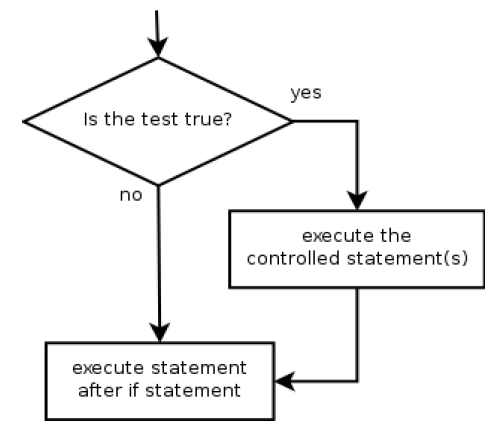
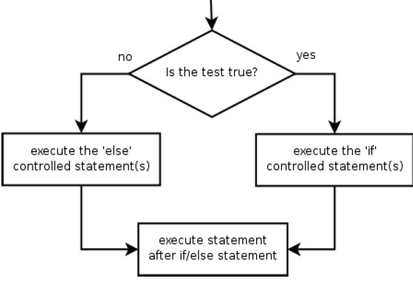
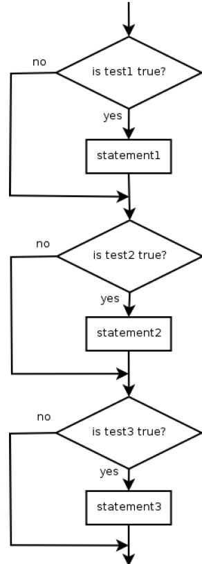
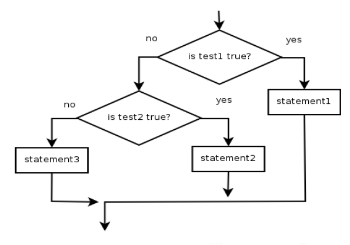
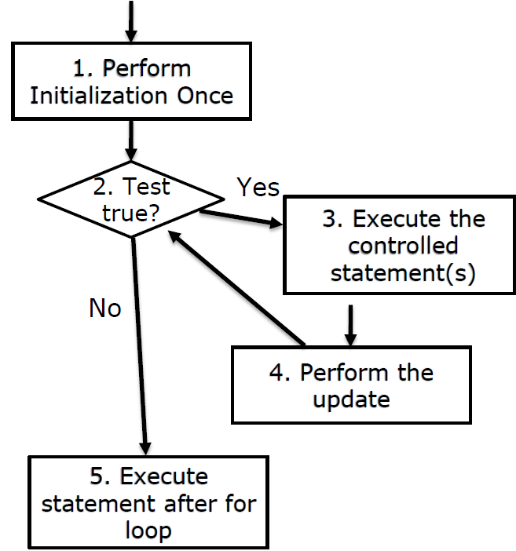
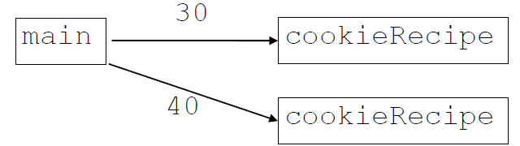
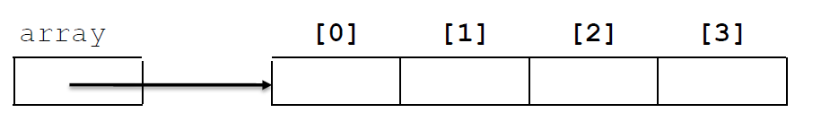
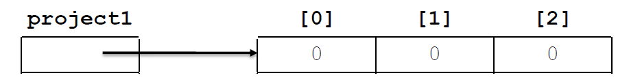

## Assignment 1
Due date: Sept 15, Tuesday at 11:45 PM

### Any questions from the last class?

### Is the Java setup working?

### How confident do you feel about Assignment 1?

### Is the course going too slow or too fast?

# Learning Objectives

 - Understanding scope
 - Revising Conditionals
 - Revising Loops
 - Revising Arrays
 - Revising Parameters and Array Types

# Scope

## What is scope?
Scope is the part of a program in which a particular declaration is valid.

## Scope of Variables

The scope of a variable is from its declaration statement to the right curly brace that encloses it.

- A variable declared in a for loop exists only in that loop.
- A variable declared in a method exists only in that method.

## Localizing Variables: 
declaring variables in the innermost scope possible

- Security
- Minimize interference from other program parts
- Efficiency

Localizing variables reduces the complexity of the code.

```java
    /**
    * Shows scope of variables -Multiples
    *
    * @authorJessica Young Schmidt
    */
    publicclassScope {
    /**
    * Starts the program.
    *
    * @paramargs
    * command line arguments
    */
    public static void main(String[] args) {
        int multiples= 2;
        System.out.println("Begin: Multiples of "+ multiples);
        for(inti= 1; i<= 10; i++) {
        System.out.println(multiples+ " * "+ i+ " = "+ multiples * i);
            } // i no longer exists
        System.out.println("End: Multiples of "+ multiples);
        } // multiples no longer exists
    }
```

## Scope: Things to Remember

- Variables without overlapping scope can have same name.

```java
for (inti= 1; i<= 100; i++) {
    System.out.print("/");
}
for (inti= 1; i<= 100; i++) { // OK
    System.out.print("\\");
}
int i= 5;
```

- A variable cannot be declared twice or used out of its scope.

```java
for (inti= 1; i<= 100 * line; i++) {
    int i= 2; // ERROR: overlapping scope
    System.out.print("/");
}
i= 4; // ERROR: outside scope
```

## Magic Numbers
Numbers that make the program work, but have no obvious meaning in the program. We should avoid magic numbers when we program by using constants.

BAD (Magic Number):

```java
for (int i= 1; i <= 10; i++) {
    System.out.println("i= " + i);
}
```
BETTER (Constant):

```java
final int MAX_VALUE = 10;
for (int i= 1; i<= MAX_VALUE; i++) {
    System.out.println("i= " + i);
}
```

 - Constants help to reduce complexity by eliminating magic numbers.
 - Constants make our programs more readable and adaptable.
 - Named constants provide explanation about the value.

# Conditionals

Instruct the computer to execute different lines of code depending on whether a condition is true or false.

 - `if` statement
 - `if/else` statements
 - Sequential `if` statements
 - Nested `if/else` statements


## if Statement
`if Statement:` a Java statement that executes only if a specific condition is true. If the condition is false, the statement is not executed.

```java

if (<condition/test>) {
    <statement>;
    <statement>;
    ...
    <statement>;
}
    <statement>;
```



```java
Scanner in = newScanner(System.in);
System.out.print("GPA: ");
double gpa= in.nextDouble();
if(gpa >= 3.0) {
    System.out.println("Application accepted.");
}
System.out.println("Thank you for applying!");
```


## if/else Statements
`if/else Statements:` One block of statements are executed if the condition is true and the other block is executed if the condition is false.

```java

if (<condition/test>) {
    <statement>;
    <statement>;
    ...
    <statement>;
} else {
<statement>;
...
<statement>;
}
```



```java
if( gpa >= 3.0) {
    System.out.println("Application accepted.");
} else{
    System.out.println("Please submit an essay");
}
System.out.println("Thank you for applying!");
```


## Sequential if Statements
`Sequential if Statements:` Choose 0, 1, or many paths through the code. Conditions and the associated actions are independent

```java

if (<condition1/test1>) {
    <statement1>;
}
if (<condition2/test2>) {
    <statement2>;
}
if (<condition3/test3>) {
    <statement3>;
}
```



```java
public static String getLetterGrade(int score) {
    String grade= "";
    if(score>= 90) {
        grade= "A";
    }
    if(score>= 80) {
        grade= "B";
    }
    if(score>= 70) {
        grade= "C";
    }
    if(score>= 60) {
        grade= "D";
    }
    if(score< 60) {
        grade= "F";
    }
    return grade;
}
```

### What would getLetterGrade(97) return?


## Nested if/else Statements
`Sequential if Statements:` Chooses between many outcomes using many conditions

 - Can end in `else` or `if`
     - `else` Choose one of many paths
     - `if` Choose one or 0 of many paths

```java
if (<condition/test1>) {
    <statement(s)> ;
} else if (<condition/test2>) {
    <statement(s)> ;
} else {
    <statement(s)> ;
}
```



```java
public static String getLetterGrade(int score) {
    String grade= "";
    if(score >= 90) {
        grade= "A";
    } else if(score >= 80) {
        grade= "B";
    } else if(score >= 70) {
        grade= "C";
    } else if(score >= 60) {
        grade= "D";
    } else{
        grade= "F";
    }
    return grade;
}
```

### What would getLetterGrade(97) return?
### What would getLetterGrade(53) return?
### What would getLetterGrade(-53) return?

```java
public static String getLetterGrade(int score) {
    String grade= "";
    if(score >= 90) {
        grade= "A";
    } else if(score >= 80) {
        grade= "B";
    } else if(score >= 70) {
        grade= "C";
    } else if(score >= 60) {
        grade= "D";
    } else if(score >= 0) {
        grade= "F";
    }
    return grade;
}
```

### What would getLetterGrade(97) return?
### What would getLetterGrade(53) return?
### What would getLetterGrade(-53) return?


### Exercise
```java
public static void ifElseMystery2(int a, int b) {
    if (a* 2 < b) {
        a = a* 3;
    } else if(a > b) {
        b = b+ 3;
    }
    if(b < a) {
        b++;
    } else{
        a--;
    }
    System.out.println(a+ " "+ b);
}
```

# Loops

## for loop

A `for` loop is a control structure (a syntactic structure that controls other statements)

 - loops reduce redundancy
 - reduces the amount of code we need

```java
System.out.println(1 + " squared = " + (1 * 1));
System.out.println(2 + " squared = " + (2 * 2));
System.out.println(3 + " squared = " + (3 * 3));
System.out.println(4 + " squared = " + (4 * 4));
System.out.println(5 + " squared = " + (5 * 5));
```

```java
intx = 1;
System.out.println(x + " squared = " + (x * x));
x++;
System.out.println(x + " squared = " + (x * x));
x++;
System.out.println(x + " squared = " + (x * x));
x++;
System.out.println(x + " squared = " + (x * x));
x++;
System.out.println(x + " squared = " + (x * x));
```

```java
for (inti= 1; i<= 5; i++) {
    System.out.println(i+ " squared = " + (i* i));
}
```
### Syntax

```java
for (<initialization>; <continuation test>; <update>){
    <statement>;
    <statement>;
    . . .
    <statement>;
}
```



### Initialization

```java
for (int i= 0; i< 5; i++){
    System.out.println(i);
}
```
`for (int i = 0;`

Tells Java what variable to use in the loop
- Performed once as the loop begins
- The variable is called a loop counter.
   - can use any name, not just i
   - can start at any value, not just 0


### Continuation Test
```java
for (int i= 0; i< 5; i++){
    System.out.println(i);
}
```
`for (... i < 5;`

Tests the loop counter variable against a limit.

Uses relational operators:

&nbsp;< &nbsp; less than<br>
&nbsp;<= &nbsp; less than or equal to<br>
&nbsp;> &nbsp; greater than<br>
&nbsp;>= &nbsp; greater than or equal to<br>

### Update

```java
for (int i= 0; i< 5; i++){
    System.out.println(i);
}
```
`for (... i++`

Updates the loop counter variable
 -  Increment and decrement by 1
 -  Increment and Decrement Operators

## Nested for Loop

*Nested loop:* A loop placed inside of another loop.

### Syntax
```java
for (<initialization>; <continuation test>; <update>){
    <statement>;
    for (<initialization>; <continuation test>; <update>){
        <statement>;
        <statement>;
        . . .
        <statement>;
    }
    . . .
    <statement>;
}
```

Example:
```java
for (int i= 0; i< 6; i++) {
    for (int j = 0; j < 10; j++) {
        System.out.print("*");
    }
    System.out.println();
}
```

Output:

```
**********
**********
**********
**********
**********
**********
```

*Infinite loop:* A loop that never terminates.

```java
int i;
for (i= 1; i<= 10; i++) {
    for (i= 1; i<= 5; i++) {
        System.out.println("hi there.");
    }
}
```

## Why does the above loop not terminate?

```java
for (int i= 1; i<= 6; i++) {
    for (int j = 1; j <= i; i++){
        System.out.print("*");
    }
    System.out.println();
}
```

## Why does the above loop not terminate?


Can you write a code to create following output?

```java

*
**
***
****
*****
```

# Parameters

## What are parameters?

Any of a set of characteristics that distinguish different members of a family of tasks.

We use parameters to:
 - Generalize a task
 - Reduce redundancy

### Redundant Cookie Recipe

Recipe for baking 20 cookies:
 - Mix the following ingredients in a bowl:
    - 4 cups flour
    - 1 cup butter
    - 1 cup sugar
    - 2 eggs
    - 40 bags chocolate chips ...
 - Place on sheet and Bake for about 10 minutes.

Recipe for baking 40 cookies:
 - Mix the following ingredients in a bowl:
    - 8 cups flour
    - 2 cups butter
    - 2 cups sugar
    - 4 eggs
    - 80 bags chocolate chips ...
 - Place on sheet and Bake for about 10 minutes.


```java
/**
* Cookie recipe for 20 cookies
*/
public static void cookieRecipe20() {
    System.out.println("Recipe for baking 20 cookies:");
    System.out.println(" -Mix the following ingredients in a bowl:");
    System.out.println(" -4 cups flour");
    System.out.println(" -1 cup butter");
    System.out.println(" -1 cup sugar");
    System.out.println(" -2 eggs");
    System.out.println(" -40 bags chocolate chips");
    System.out.println(" -...");
    System.out.println(" -Place on sheet and Bake for about 10 minutes.");
    System.out.println();
}
/**
* Cookie recipe for 40 cookies
*/
public static void cookieRecipe40() {
    System.out.println("Recipe for baking 40 cookies:");
    System.out.println(" -Mix the following ingredients in a bowl:");
    System.out.println(" -8 cups flour");
    System.out.println(" -2 cup butter");
    System.out.println(" -2 cup sugar");
    System.out.println(" -4 eggs");
    System.out.println(" -80 bags chocolate chips");
    System.out.println(" -...");
    System.out.println(" -Place on sheet and Bake for about 10 minutes.");
    System.out.println();
}

/**
* Starts the program.
*
* @param args command line arguments
*/
public static void main(String[] args) {
    cookieRecipe20();
    cookieRecipe40();
}

```


### Parameterized Cookie Recipe

Recipe for baking N cookies:
 - Mix the following ingredients in a bowl:
    - N/5 cups flour
    - N/20 cups butter
    - N/20 cups sugar
    - N/10 eggs
    - 2N bags chocolate chips ...
 - Place on sheet and Bake for about 10 minutes.

`In the cookie example, N is a parameter.`

```java
/**
* Cookie recipe (Limitation: numCookies should be a multiple of 10 since we
* cannot add a portion of an egg)
*
* @param numCookies
* number of cookies the recipe will make
*/
public static void cookieRecipe(intnumCookies) {
    System.out.println("Recipe for baking "+ numCookies+ " cookies:");
    System.out.println(" -Mix the following ingredients in a bowl:");
    System.out.println(" -"+ (numCookies/ 5) + " cups flour");
    System.out.println(" -"+ (numCookies/ 20.0) + " cup butter");
    System.out.println(" -"+ (numCookies/ 20.0) + " cup sugar");
    System.out.println(" -"+ (numCookies/ 10) + " eggs");
    System.out.println(" -"+ (2 * numCookies) + " bags chocolate chips");
    System.out.println(" -...");
    System.out.println(" -Place on sheet and Bake for about 10 minutes.");
    System.out.println();
}

/**
* Starts the program.
*
* @param args
* command line arguments
*/
public static void main(String[] args) {
    cookieRecipe(20);
    cookieRecipe(40);
    cookieRecipe(400);
}

```

### Parameterization

- Instead of cookieRecipe20, cookieRecipe40, write cookieRecipeto output the recipe for any number of cookies.
   - We restrict it to multiple of 10 cookies so we are not adding a portion of an egg.
 - When declaring the method, we will state that it requires a parameter for the number of cookies.
 - When calling the method, we will specify how many cookies.




### Syntax

 - Method Header
`public static void cookieRecipe(intnumCookies) {`
 - Method Call
`cookieRecipe(40);`
 -  Multiple Parameters
 ```java
public static void <name> (<type1> <pname1>, ... <typeN> <pnameN>) {
    <statement(s)>;
}
```
 - Passing parameters by calling a method and specifying values for its parameters

 `<methodName> (<expression of type1>, ... <expression of typeN>);`
 
### Method Overloading

The ability to define two or more different methods with the same name but different method signatures.

*Method Signatures:* The name of a method, along with the number and types of parameters

`line(5, '*');`

VS

`line('*');`


```java
/**
* Draws a line of character
* @param num number of characters in the line
* @param character character to repeat in line
*/
public static void line(int num, char character) {
for(inti= 1; i<= num; i++) {
    System.out.print(character);
}
System.out.println();
}
/**
* Draws a single character
* @param character character to output once
*/
public static void line(char character) {
    System.out.println(character);
}
```

### Value Semantics

When primitive variables (e.g., int, double) are passed as parameters, their values are copied.
 - Modifying the parameter will not affect the variable passed in.
 - *Note: this will be different for objects*

```java
public static void strange(int x) {
    x= x + 1;
    System.out.println("1. x = "+ x); // outputs 24
}

public static void main(String[] args) {
    int x= 23;
    strange(x);
    System.out.println("2. x = "+ x); // outputs 23
// ...
}
```
# Return Values
To send a value out as the result of a method that can be used in an expression in your program.

 - Void method do not return any value.


 Static Method without Return Value
 ```java
public static void <name> (<type1> <pname1>, ... <typeN> <pnameN>) {
    <statement(s)>;
}
```

Static Method with Return Value


 ```java
public static <type> <name> (<type1> <pname1>, ... <typeN> <pnameN>) {
    <statement(s)>;
    return <expression of type>;
}
```

## Return Statements

 - Specifies the value to return, terminating the method
 `return <expression>;`
 - Statements after the return statement will not be executed.
 - Methods with a non-void return type must contain one or more return statement(s).

```java
/**
* Adds a and b together, then returns the result
* @parama first integer in the addition
* @paramb second integer in the addition
* @returna + b
*/
public  static  int addNumbers(int a, int b) {
    returna+ b;
}
```

## Common Errors for Parameters and Return Values

 - Calling method without parameter
   - If a method accepts a parameter, it is illegal to call the method without passing any value for that parameter.

   `cookieRecipe(); //ERROR: intparameter value required`
 - Passing parameter of the wrong type
   - The value passed to a method must be of the correct type.

`cookieRecipe(23.7); //ERROR: parameter must be of type int`
 - Not storing the return value.
    - The returned value must be stored into a variable or used in an expression to be useful to the caller

```java
public static void main(String[] args) {
    slope(0, 0, 6, 3);
    System.out.println("The slope is "+ s);
}
```

```java
public static void main(String[] args) {
    double s = slope(0, 0, 6, 3);
    System.out.println("The slope is "+ result);
}
```

 - Placing statements after a return statement. Any statements after a return statement will never be reached!


### Returning with Conditionals

```java
public static int max(int x, int y) {
    if(x > y) {
        return x;
    } else{
        return y;
    }
}
```

# Arrays

 - `Array`: a structure that holds multiple values of the same type
    - "An array is a simple but powerful programming language construct used to group and organize data." [Lewis and Loftus]
 - Elements:values stored in an array
 - Index:an integer indicating the position of a value in a data structure
    - Arrays use zero-based indexing




### Example

Option 1 - individual project 1 variables

```java
int project1student1;
int project1student2;
...
int project1student1000;
```


Option 2 – project 1 array

```java
int[] project1;
```

## Constructing Arrays
 - Arrays are objects so must be constructed
 `int[] project1 = new int[3];`

 - Syntax template
`<type>[] <name> = new <type>[<size>];`

## Auto initialization

 - The initialization of variables to a default value, as in the initialization of array elements when an array is constructed.
 
 `int[] project1 = new int[3];`


| Type      | Value |
|-----------|-------|
| `int`     | `0`   |
| `double`  | `0.0` |
| `char`    | `'\0'`|
| `boolean` | `false` |
| Objects   | `null` |

`null: a java keyword signifying no object`


### Create an intarray to store the project one grades for 10 students.

 - Accessing an Array Element: `project1[2]`
 - Getting Length of Array: `project1.length`

### Array Traversal

```java
for (int i = 0; i< <array>.length; i++){
    <do something with <array>[i]>
}
```

```java

for (int i = 0; i< project1.length; i++){
    System.out.println(project1[i]);
}
```

```java
String s = "COSC130";
for (int i= 0; i< s.length(); i++){
    System.out.println(s.charAt(i));
}
```

#### Shorthand Initialization
`<type>[] <name> = {<value>, <value>,... <value>};`

`char[] size = {'S', 'M', 'L'};`

`int[] daysIn= {31, 28, 31, 30, 31, 30,31, 31, 30, 31, 30, 31};`

`String[] dayNames= {"Mon", "Tue", "Wed", "Thu", "Fri", "Sat", "Sun"};`

### Initializing Arrays with Loops

Because arrays are indexed, using a loop to initialize arrays is really efficient

```java
Scanner in = new Scanner (System.in);
for (int i = 0; i< project1.length; i++){
    System.out.print("Project 1 grade: ");
    project1[i] = in.nextInt();
}
```

**Array elements** can be treated as variables of a given type

```java
int x = 0;
int[] list = new int[3];

x = 3;
list[1] = 3;

x++;
list[2]++;

x--;
list[0]--;

x *= 2;
list[0]*= 2;
```

`ArrayIndexOutOfBoundsException`: Trying to access an element of an array at an index less than 0 or greater than `length-1`

```java
int[] list = new int[10];
list[-3] = 15; // illegal
intx= list[27]; // illegal
```


### Array as Parameters

When you pass an array as a parameter to a method, the method has the ability to change the contents of the array.

```java
public class ArrayAlgorithms{
    public static void main(String[] args){
        int[] list = new int[10];
        for (int i = 0; i < list.length; i++) {
            list[i] = 2 * i + 1;
        }
        incrementAll(list);
    }

    public static void incrementAll(int[] data) {
        for (int i = 0; i < data.length; i++) {
            data[i]++;
        }
    }
}
```

**Note: Arrays are objects: the reference is passed, so modifying array elements changes the original data, unlike primitive types.**

### Limitations of Array

1. You cannot resize an existing array:
```java
int[] a = new int[4];
a.length= 10;// error
```
2. You cannot compare arrays with == or equals:
```java
int[] a1 = {42, -7, 1, 15};
int[] a2 = {42, -7, 1, 15};
if (a1 == a2) { ... } // false!
if (a1.equals(a2)) { ... } // false!
```
3. An array does not know how to print itself:
```java
int[] a1 = {42, -7, 1, 15};
System.out.println(a1);// [I@98f8c4]
```

### Arrays Class
 - Addresses limitations of arrays in java
 - Part of the java.util package, which must be imported.
     - [`java.util.Arrays`](https://docs.oracle.com/en/java/javase/21/docs/api/java.base/java/util/Arrays.html)
 - Useful array manipulation methods

| Return  | Method                    | Description |
|---------|---------------------------|--------------|
| `int`     | `binarySearch(array, value)` | Returns the index of the given value in a **sorted** array (returns negative number if value doesn't exist) |
| `boolean` | `equals(array1, array2)`     | Returns true if arrays contain the same values in the same order |
| `void`    | `fill(array, value)`         | Sets every element to the value |
| `void`    | `sort(array)`                | Sorts the array into ascending order |
| `String`  | `toString(array)`            | Returns a String containing the array elements, like: `[3, 8, 7, 9, 2]` |
| `String`  | `deepToString(array)`        | Returns a String containing the array elements of multidimensional arrays |

### Syntax
`Arrays.<methodName>(<parameters>)`

Example: `Arrays.toString` accepts an array as a parameter and returns a Stringrepresentation of its elements.
```java
int[] primes = { 2, 3, 5, 7, 11, 13, 17, 19 };
System.out.println(primes); //[I@fee4648
System.out.println(Arrays.toString(primes)); //[2, 3, 5, 7, 11, 13, 17, 19]
```

### How do we know two arrays are equal?

> 
> 
> 
>
>

### Swapping Values

```java
int x = 5;
int y = 1;
int temp = x;
x = y;
y = temp;
```

### Reversing Array

 - Reverse order of elements stored in array
     - Array {3, 8, 7, -2, 14, 78} would become array {78, 14, -2, 7, 8, 3}
 - Algorithm
     - swap elements 0 and length-1
     - swap elements 1 and length-2
     - continue until array is completely reversed


### Exercise: Create an array of `char` containing your first name, a space, and your last name (e.g., `"Jane Doe"` converted to a `char[]`). Create a method to reverse the array. Print the elements of the reversed array.

> 
> 
> 
>
>
> 
> 
> 
>
>
> 
> 
> 
>
>


#### Did your method return a value?