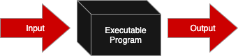
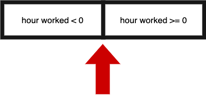

## Source

::: {.callout-note appearance="simple"}
This material is based off of *An Introduction to Java: A Textbook for CSC116 at NC State*, by Jessica Young Schmidt. The testing chapters were written by Sarah Heckman, Jason King, and Jessica Young Schmidt.
:::

| Topic | Textbook Chapter |
|:--|:--|
| Software Testing Introduction | Chapter 4 |
| System Testing | Chapter 4 |
| System Testing – Conditionals | Chapter 7 |
| Unit & Integration Testing | Chapter 9 |
| Testing Loops | Chapter 11 |
| Testing Arrays | Chapter 13 |
| Testing Objects | Chapter 18 |

# Software Testing Introduction

## Why Test?

- Developers turn **requirements** into a design, then into code
- The code may **not match** the requirements
- Cost of a mismatch:
  - Company → lost revenue (millions, even billions), lost customer confidence
  - You → lost points on an assignment

. . .

**Goal of testing:** find and remove as many faults as possible *before* the customer sees the program.

## What Is Software Testing?

> "the **dynamic** verification of the behavior of a program on a finite set of test cases, **suitably selected** from the usually infinite execution domains, against the **expected behavior**." — ISO SWEBOK

- **Dynamic** – we *run* the code under test
- **Suitably selected** – we choose test inputs deliberately
- **Expected behavior** – we know what the program *should* do

## Mistake → Fault → Failure

| Term | Meaning |
|:--|:--|
| **Mistake** | A human action that produces an incorrect result |
| **Fault** (logic error) | An incorrect step, process, or data definition in a program |
| **Failure** | The system does not perform a required function within specified limits |
| **Debugging** | Investigating a failure to find and fix the underlying fault |

::: {.callout-tip}
A **mistake** puts a **fault** in the code. Running the faulty code produces a **failure**. Testing reveals failures; debugging finds the fault.
:::

## Test Cases

A **test case** is one execution of the program with a given input and expected output.

1. **Unique Identifier** – descriptive name for the test
2. **Test Inputs** – must be **specific** and **repeatable**
3. **Expected Results** – specific values, determined from the **requirements**
4. **Actual Results** – what actually happened

. . .

Expected ≠ Actual → **failing test**


## Testing Can't Prove Correctness

- Passing tests **increase confidence** the program meets its requirements
- More tests → more confidence
- But **no amount of testing** can prove the absence of faults

. . .


## Two Testing Techniques

:::: {.columns}
::: {.column width="50%"}
### System Testing

- Closed-box / black-box
- Tests the **whole program**
- Based on **requirements**
- Implementation unknown
:::

::: {.column width="50%"}
### Unit & Integration Testing

- Open-box / white-box
- Tests **methods**
- Based on **the code**
- Implementation known
:::
::::

## Project Directory Structure

```
Paycheck
    -> src            source code
    -> test           test code
    -> lib            library files (JUnit)
    -> bin            compiled .class files
    -> doc            generated Javadoc
    -> test-files     test input/output files
    -> project_docs   project documents (System Test Plan)
```


# System Testing

## What Is System Testing?

{fig-align="center" width="55%"}

- Ignores the internals; focuses on **inputs** and **expected outputs**
- Also called *functional*, *closed-box*, or *black-box* testing
- Tests come from the **requirements**
- Tip: **write system tests before you write the code**

## What System Testing Finds

- Incorrect or missing functions
- Interface errors
- Errors in data structures or external database access
- Behavior or performance errors
- Initialization and termination errors

::: aside
Pressman, R. S. (2005). *Software Engineering: A Practitioner's Approach* (6th ed.).
:::

## The System Test Plan

| Test ID | Description | Expected Results | Actual Results |
|:--|:--|:--|:--|
| Unique name<br>Requirement(s) tested<br>Strategy<br>Author | Preconditions<br>**Specific** inputs | **Specific** output from the requirements | Filled in when run |

- Say "enter **15**", not "enter a value between 10 and 20"
- Expected results are decided **before** running the program

## Recording Actual Results

- **Pass** → write "Pass"
- **Fail** → write "Fail" + actual output / error message
- After debugging, **rerun all tests** — passing ones too
  - A fix can introduce a new fault!
- The final test plan should have **no failures**

## Three System Testing Strategies

1. **Test requirements** – every requirement tested at least once
2. **Test equivalence classes** – one representative value per class
3. **Test boundary values** – at and around every boundary

. . .

One test can satisfy more than one strategy.

## Example: Simplified Paycheck

- Prompts the user for **hours worked** (no data-type error checking)
- Prints hours worked, hourly pay rate (**$19.00**), and paycheck amount
- Negative hours → negative paycheck

**Requirements**

1. The system shall allow the user to enter hours worked.
2. The system shall generate a paycheck for the week.
    - 2.1 includes hours worked
    - 2.2 includes hourly pay rate
    - 2.3 includes paycheck amount


## Strategy 1: Test Requirements

Test **every requirement at least once**. **Bold** = what the tester types.

| Test ID | Description | Expected Results | Actual |
|:--|:--|:--|:--|
| **PositiveHours**<br>Tests Req. 1, 2 | Program started<br>Enter hours worked: **10** | Pay: $190.00 | |

## Strategy 2: Equivalence Classes

- We can't test every input — pick tests that find **new** errors
- Split inputs into classes handled the **same way**; test one value from each
- At minimum: **valid** and **invalid** input

| Input condition is… | Equivalence classes |
|:--|:--|
| A **range** | 1 valid + 2 invalid (below, above) |
| **Specific values** | each value valid; everything else invalid |
| **Members of a set** | members valid; everything else invalid |
| A **boolean** | 1 valid + 1 invalid |

Pick a value from the **middle** of a range, not the edge.

## Equivalence Classes: Example

Hours worked has two classes: **positive** and **negative**.

| Test ID | Hours entered | Expected Results |
|:--|:-:|:--|
| **PositiveHours** | **10** | Pay: $190.00 |
| **NegativeHours** | **-10** | Pay: $-190.00 |

## Strategy 3: Boundary Values

- Programmers often make mistakes **at the edges**
- Test the boundary **and** the value on each side

{fig-align="center" width="35%"}

| Test ID | Input | Expected Paycheck |
|:--|:--|:--|
| **Test03** | **1** | $19.00 |
| **Test04** | **0** | $0.00 |
| **Test05** | **-1** | $-19.00 |

# System Testing – Conditionals

## The Paycheck Problem

Same idea as Simple Paycheck, but now pay depends on the employee's **skill level**:

| Skill Level | Hourly Pay Rate |
|:--|--:|
| Level 1 | $19.00 |
| Level 2 | $22.50 |
| Level 3 | $25.75 |

- User enters: **name**, **skill level**, **hours worked**
- Program prints: **name**, **hours**, **pay rate**, **pay** (rate × hours)
- Skill level not 1, 2, or 3 → **error**
- Negative hours → **error**

## Where Are the Conditionals?

Every **"if"** in the requirements is a place the program makes a decision:

- **If** level is 1 → $19.00, **else if** 2 → $22.50, **else if** 3 → $25.75, **else** → error
- **If** hours is negative → error

. . .

::: {.callout-tip}
Each branch of a decision is a different **equivalence class** — test every one!
:::

## Testing a Requirement

Start by testing a requirement: pay for a level 1 employee. **Bold** = what the tester types.

| Test ID | Description | Expected Results | Actual |
|:--|:--|:--|:--|
| **Test01**<br>Equiv. Class (Level 1, positive hours) | Preconditions: Paycheck program started<br>Employee Name: **Alice Anderson**<br>Skill Level: **1**<br>Hours Worked: **10** | Name: Alice Anderson<br>Hours: 10.00<br>Pay Rate: 19.00<br>Pay: 190.00 | |

## Identifying Equivalence Classes

| Input | Equivalence classes |
|:--|:--|
| Skill level | Level 1 · Level 2 · Level 3 · invalid (below 1) · invalid (above 3) |
| Hours worked | valid (0 or more) · invalid (negative) |

. . .

Skill level is a **range** (1–3) → one valid range + **two** invalid ranges. <br>
Since each level has its own rate, we test **each** valid level separately.

## Equivalence Class Tests

| Test | Class | Name | Level | Hours | Expected |
|:--|:--|:--|:-:|--:|:--|
| Test01 | Level 1 | Alice Anderson | **1** | **10** | Rate 19.00, Pay 190.00 |
| Test02 | Level 2 | Bob Baker | **2** | **10** | Rate 22.50, Pay 225.00 |
| Test03 | Level 3 | Carol Cole | **3** | **10** | Rate 25.75, Pay 257.50 |
| Test04 | Invalid level (below) | Danny David | **-2** | **10** | Error: invalid skill level |
| Test05 | Invalid level (above) | Ellen Edwards | **7** | **10** | Error: invalid skill level |
| Test06 | Negative hours | Frank Frankenstein | **1** | **-10** | Error: invalid hours |


::: {.callout-tip}
Pick values from the **middle** of each class (e.g., -2 and 7), not the edges. The edges come next.
:::

## Finding the Boundaries

```
Skill level:   ...  -1   0  |  1   2   3  |  4   5  ...
                  invalid   |    valid    |  invalid

Hours worked:  ...  -2  -1  |  0   1   2  ...
                  invalid   |    valid
```

- Skill level has **two** boundaries: between **0 | 1** and **3 | 4**
- Hours worked has **one** boundary: between **-1 | 0**
- Test the value **on each side** of every boundary

## Boundary Value Tests

| Test | Boundary | Name | Level | Hours | Expected |
|:--|:--|:--|:-:|--:|:--|
| Test07 | Level just below 1 | George George | **0** | **20** | Error: invalid skill level |
| Test08 | Lowest valid level | Hilda Henderson | **1** | **20** | Rate 19.00, Pay 380.00 |
| Test09 | Highest valid level | Ian Irwin | **3** | **20** | Rate 25.75, Pay 515.00 |
| Test10 | Level just above 3 | Jill Jones | **4** | **20** | Error: invalid skill level |
| Test11 | Hours just below 0 | Kim King | **2** | **-1** | Error: invalid hours |
| Test12 | Lowest valid hours | Liam Lee | **2** | **0** | Rate 22.50, Pay 0.00 |
| Test13 | Hours just above 0 | Mia Moore | **2** | **1** | Rate 22.50, Pay 22.50 |

## Practice: Meeting Attendance {background-color="#fff8e1" .smaller}

**Meeting Attendance Requirements**

The user is prompted for the number of people who will be attending a meeting. If the user enters a non-integer (such as `0people`), an exception will be thrown, and the program will end.

Based on the number of people who will be attending the meeting, one of the following messages will be printed:

- "The meeting will be in an office with up to four people in attendance"
- "The meeting will be in a meeting room with 5-10 people in attendance"
- "Invalid meeting count of fewer than three people or more than 10 people"

::: {.callout-note appearance="simple"}
Write **two equivalence class** tests and **two boundary value** tests. In the Description, say whether each test is a **boundary value** or an **equivalence class** test.
:::

| Test ID | Description | Expected Results |
|:--|:--|:--|
| &nbsp;<br><br> | | |
| &nbsp;<br><br> | | |
| &nbsp;<br><br> | | |
| &nbsp;<br><br> | | |


## References

- Schmidt, J. Y. *An Introduction to Java: A Textbook for CSC116 at NC State*. Testing chapters by S. Heckman, J. King, and J. Y. Schmidt.
- Pressman, R. S. (2005). *Software Engineering: A Practitioner's Approach* (6th ed.). McGraw-Hill.
- ISO/IEC/IEEE 24765:2010(E). *Systems and software engineering – Vocabulary*.
- ISO/IEC TR 19759:2005. *Guide to the Software Engineering Body of Knowledge (SWEBOK)*.
- JUnit 5: <https://junit.org/junit5/>


## Assignment 4