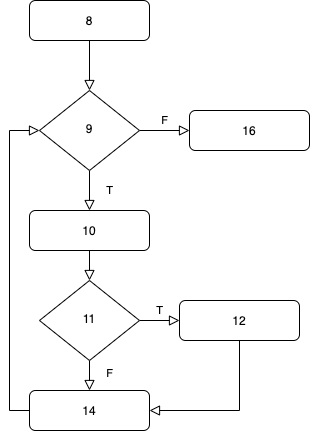
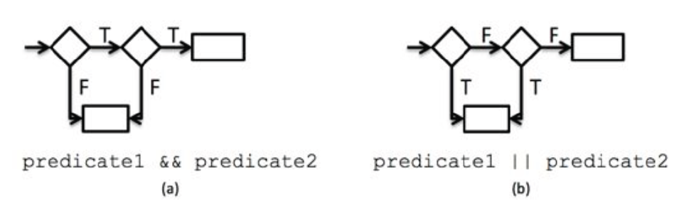
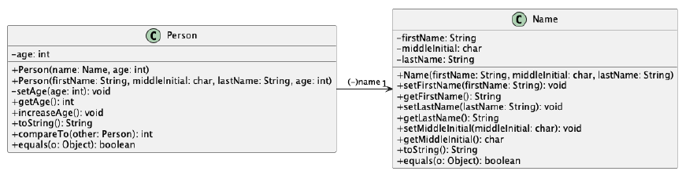

## Source

::: {.callout-note appearance="simple"}
This material is based off of *An Introduction to Java: A Textbook for CSC116 at NC State*, by Jessica Young Schmidt. The testing chapters were written by Sarah Heckman, Jason King, and Jessica Young Schmidt.
:::

| Topic | Textbook Chapter |
|:--|:--|
| Software Testing Introduction | Chapter 4 |
| System Testing | Chapter 4 |
| System Testing – Conditionals | Chapter 7 |
| Unit & Integration Testing | Chapter 9 |
| Testing Loops | Chapter 11 |
| Testing Arrays | Chapter 13 |
| Testing Objects | Chapter 18 |


# Unit & Integration Testing

## Open-Box Testing

- The code under test is **known** — use it to guide your tests
- Also called *open-box* or *white-box* testing
- Lets the tester:
  1. exercise **independent paths** in the code
  2. exercise every **decision** as both true and false
  3. exercise **loops at their boundaries**

## Unit vs. Integration

- **Unit testing** – test one unit of code (for us: **one method**)
- **Integration testing** – test how units **work together** (e.g., one method calls another)

. . .

System testing strategies still apply — requirements, equivalence classes, boundaries — plus a new one:

**Basis set testing** – exercise **every path** through the code.

## JUnit 5

- A framework for **automating** unit and integration tests in Java
- Not part of the standard Java library — download it
- Put `junit-platform-console-standalone-1.6.2.jar` in `lib/`

```
Paycheck
    -> src
        -> Paycheck.java
    -> test
        -> PaycheckTest.java
    -> lib
        -> junit-platform-console-standalone-1.6.2.jar
    -> bin
```

## Writing a Test Class

- Test class name: `<SourceClass>Test` → `PaycheckTest.java` in `test/`
- Test method name: `test<MethodName><Description>`
- Call methods under test like `Math` methods:

```java
Paycheck.calculateRegularPay(Paycheck.LEVEL_1_PAY_RATE, 36);
```

**Annotations**

- `@Test` – marks a test method
- `@BeforeEach` – runs **before every** test (sets up a fresh starting state)

## Test Class Skeleton

```{.java code-line-numbers="1,3|12-15|17-20"}
import static org.junit.jupiter.api.Assertions.*;

import org.junit.jupiter.api.Test;

/**
 * Test class for the Paycheck program.
 *
 * @author Sarah Heckman
 * @author Jessica Young Schmidt
 */
public class PaycheckTest {
    /** Test the Paycheck.getPayRate() method. */
    @Test
    public void testGetPayRate() {
    }

    /** Test the Paycheck.calculateRegularPay() method. */
    @Test
    public void testCalculateRegularPay() {
    }
}
```

## Assert Statements

**In this course, always use the version with a message** (your test description).

| Method | Passes when… |
|:--|:--|
| `assertTrue(condition, message)` | `condition` is `true` |
| `assertFalse(condition, message)` | `condition` is `false` |
| `assertEquals(expected, actual, message)` | `int`, `char`, `Object` values are equal |
| `assertEquals(expected, actual, delta, message)` | `double` values are within `delta` |
| `assertThrows(Exception.class, () -> ..., message)` | the code throws that exception |

## Compiling

From the top-level project directory:

```bash
$ javac -d bin -cp bin src/Paycheck.java
```

::: {.panel-tabset}
### Linux / Mac

```bash
$ javac -d bin -cp "bin:lib/*" test/PaycheckTest.java
```

### Windows

```bash
$ javac -d bin -cp "bin;lib/*" test/PaycheckTest.java
```
:::

- `-d bin` → put `.class` files in `bin`
- `-cp` → classpath: where compiled classes and libraries are
- Separator: `:` on Linux/Mac, `;` on Windows

## Running the Tests

```bash
$ java -jar lib/junit-platform-console-standalone-1.6.2.jar -cp bin -c PaycheckTest
```

Shortcut (if it's the only jar in `lib`):

```bash
$ java -jar lib/* -cp bin -c PaycheckTest
```

More detail:

```bash
$ java -jar lib/* -cp bin -c PaycheckTest --details verbose
```

## Reading the Results

```{.default code-line-numbers="4-8|11-14|19-20"}
- JUnit Jupiter (check)
   - PaycheckTest (check)
      - testCalculateNetPay() (check)
      - testCalculateOvertimePay() X
           Paycheck.calculateOvertimePay
           (Paycheck.LEVEL_1_PAY_RATE, 36)
           ==> expected: <0> but was: <1>
      - testCalculateRegularPay() (check)

Failures (1):
  JUnit Jupiter:PaycheckTest:testCalculateOvertimePay()
    => org.opentest4j.AssertionFailedError: ...
       ...
       PaycheckTest.testCalculateOvertimePay(PaycheckTest.java:159)

Test run finished after 108 ms
[         6 tests found           ]
...
[         5 tests successful      ]
[         1 tests failed          ]
```

- Your **message** tells you which test failed
- The **stack trace** shows the line in your test

## Five Unit Testing Strategies

1. Test **requirements**
2. Test **equivalence classes**
3. Test **boundary values**
4. Test **all paths**
5. Test **exceptions**

## The Method Under Test

```java
/**
 * Returns the employee's regular pay for the hours worked up
 * to the first REGULAR_PAY_MAX_HOURS hours worked.
 */
public static int calculateRegularPay(int payRate,
                                      double hoursWorked) {
    if (hoursWorked > REGULAR_PAY_MAX_HOURS) {
        return payRate * REGULAR_PAY_MAX_HOURS;
    }
    return (int) (payRate * hoursWorked);
}
```

::: {.callout-note}
Pay is stored in **cents**: `LEVEL_1_PAY_RATE` is `1900` ($19.00). So 36 hours → `68400` ($684.00).
:::

## 1. Test Requirements

Test the method's **main functionality**: return regular pay for a rate and hours.

```java
@Test
public void testCalculateRegularPay() {
    // Regular Level 1 36 hours
    assertEquals(68400,
        Paycheck.calculateRegularPay(Paycheck.LEVEL_1_PAY_RATE, 36),
        "calculateRegularPay for level 1 rate and 36 hours");
}
```

## 2. Test Equivalence Classes

Hours worked: **< 0**, **0 to 40**, **> 40** → pick values away from 40

```java
@Test
public void testCalculateRegularPayEquivalenceClass() {
    // Regular Level 1 36 hours
    assertEquals(68400,
        Paycheck.calculateRegularPay(Paycheck.LEVEL_1_PAY_RATE, 36),
        "calculateRegularPay for level 1 rate and 36 hours");

    // Regular Level 1 46 hours
    assertEquals(76000,
        Paycheck.calculateRegularPay(Paycheck.LEVEL_1_PAY_RATE, 46),
        "calculateRegularPay for level 1 rate and 46 hours");
}
```

## 3. Test Boundary Values

Boundary at **40** → test **39**, **40**, **41** (do the same for 0)

```java
@Test
public void testCalculateRegularPayBoundary() {
    assertEquals(74100,
        Paycheck.calculateRegularPay(Paycheck.LEVEL_1_PAY_RATE, 39),
        "calculateRegularPay for level 1 rate and 39 hours");
    assertEquals(76000,
        Paycheck.calculateRegularPay(Paycheck.LEVEL_1_PAY_RATE, 40),
        "calculateRegularPay for level 1 rate and 40 hours");
    assertEquals(76000,
        Paycheck.calculateRegularPay(Paycheck.LEVEL_1_PAY_RATE, 41),
        "calculateRegularPay for level 1 rate and 41 hours");
}
```

## 4. Test All Paths

- Make sure **every path** runs at least once
- The set of paths = the **basis set**
- Draw the **control flow graph**:
  - ◆ **Diamond** = decision (condition)
  - ▭ **Rectangle** = statement(s)


## Control Flow Templates

`````{.java .number-lines code-line-numbers="true"}
/**
 * Returns the hours worked for a given employee
 *
 * @param console Scanner for reading from the console
 * @return hours worked
 */
public static double getHoursWorked(Scanner console) {
    double hoursWorked = 0;
    while (hoursWorked <= 0) {
        System.out.print("Hours Worked: ");
        if (console.hasNextDouble()) {
            hoursWorked = console.nextDouble();
        }
        clearLine(console);
    }
    return hoursWorked;
}
`````


{fig-align="center" height="520"}

## Compound Conditions

Each part of `&&` / `||` gets its **own diamond**.

- `&&` – body runs only if **both** are true
- `||` – body runs if **either** is true

{fig-align="center" width="85%"}


## Paths Aren't Enough

::: {.callout-warning}
If your code is **missing functionality**, path-based tests won't catch it — there's no path for code that doesn't exist!

Always also test from the **requirements** and **equivalence classes**.
:::

## 5. Test Exceptions

```java
public static int calculateRegularPay(int payRate, double hoursWorked) {
    if (hoursWorked < 0) {
        throw new IllegalArgumentException("Negative hours worked");
    }
    ...
}
```

Check **both** that it throws **and** the message:

```java
@Test
public void testCalculateRegularPayException() {
    Exception exception = assertThrows(IllegalArgumentException.class,
        () -> Paycheck.calculateRegularPay(Paycheck.LEVEL_3_PAY_RATE, -1),
        "Testing negative hours worked");
    assertEquals("Negative hours worked", exception.getMessage(),
        "Testing negative hours worked - exception message");
}
```

# Testing Arrays

## What to Test with Arrays

- **Size** – an empty array, one element, many elements
- **Contents** – are the values right?
- **Invalid input** – what if the array is `null`?
- **Not modified** – if the method shouldn't change the array, check that it didn't

## `assertArrayEquals`

Checks that two arrays have the **same length** and the **same values** in the same order.

| Method | Use for |
|:--|:--|
| `assertArrayEquals(int[] expected, int[] actual, message)` | `int` arrays (also `char`, `String`, …) |
| `assertArrayEquals(double[] expected, double[] actual, delta, message)` | `double` arrays |

::: {.callout-warning}
Don't use `assertEquals` on two arrays — it checks whether they are the **same object**, not whether they hold the same values.
:::

## Example: `ArrayUtils`

```java
public class ArrayUtils {

    /** Returns the sum of the values in the array */
    public static int sum(int[] values) {
        if (values == null) {
            throw new IllegalArgumentException("Null array");
        }
        int total = 0;
        for (int i = 0; i < values.length; i++) {
            total += values[i];
        }
        return total;
    }

    /** Returns a NEW array with every value doubled */
    public static int[] doubleValues(int[] values) {
        int[] result = new int[values.length];
        for (int i = 0; i < values.length; i++) {
            result[i] = values[i] * 2;
        }
        return result;
    }
}
```

## Our Test Plan

| Test method | Input | Expected |
|:--|:--|:--|
| `testSumEmpty` | `{}` | `0` |
| `testSumOne` | `{5}` | `5` |
| `testSumMany` | `{1, 2, 3, 4}` | `10` |
| `testSumNull` | `null` | `IllegalArgumentException` |
| `testDoubleValuesEmpty` | `{}` | `{}` |
| `testDoubleValuesMany` | `{1, 2, 3}` | `{2, 4, 6}` |
| `testDoubleValuesNotModified` | `{1, 2, 3}` | original still `{1, 2, 3}` |

## Testing `sum`: Array Size

```java
@Test
public void testSumEmpty() {
    int[] values = {};
    assertEquals(0, ArrayUtils.sum(values), "Sum of empty array");
}

@Test
public void testSumOne() {
    int[] values = {5};
    assertEquals(5, ArrayUtils.sum(values), "Sum of one value");
}

@Test
public void testSumMany() {
    int[] values = {1, 2, 3, 4};
    assertEquals(10, ArrayUtils.sum(values), "Sum of many values");
}
```

## Testing `sum`: Invalid Input

```java
@Test
public void testSumNull() {
    Exception exception = assertThrows(IllegalArgumentException.class,
        () -> ArrayUtils.sum(null), "Sum of null array");
    assertEquals("Null array", exception.getMessage(),
        "Sum of null array - exception message");
}
```

## Testing `doubleValues`: Contents

```java
@Test
public void testDoubleValuesEmpty() {
    int[] values = {};
    int[] expected = {};
    assertArrayEquals(expected, ArrayUtils.doubleValues(values),
        "Double an empty array");
}

@Test
public void testDoubleValuesMany() {
    int[] values = {1, 2, 3};
    int[] expected = {2, 4, 6};
    assertArrayEquals(expected, ArrayUtils.doubleValues(values),
        "Double many values");
}
```

## Did the Method Change My Array?

`doubleValues` should return a **new** array and leave the original alone.

```{.java code-line-numbers="3|4|5-6"}
@Test
public void testDoubleValuesNotModified() {
    int[] values = {1, 2, 3};
    ArrayUtils.doubleValues(values);
    assertArrayEquals(new int[] {1, 2, 3}, values,
        "Original array not modified");
}
```

Compare against a **separate copy** of the original values.

# Testing Objects

## What Changes When Testing Objects?

- **Unit testing** – one test class per source class
- **System testing** – make sure your classes work together in the whole program

. . .

In the test class:

- Sample objects are **private fields**
- A `setUp` method with **`@BeforeEach`** creates them fresh **before every test**

## Example: `Name` and `Person`

{fig-align="center" width="100%"}

## `Name`: Key Methods

```java
public void setFirstName(String firstName) {
    if (firstName == null || firstName.trim().equals("")) {
        throw new IllegalArgumentException("Invalid first name");
    }
    this.firstName = firstName.trim();
}

public String toString() {
    return firstName + " " + middleInitial + ". " + lastName;
}

public boolean equals(Object o) {
    if (o instanceof Name) {
        Name that = (Name) o;
        return this.firstName.equals(that.firstName)
                && this.lastName.equals(that.lastName)
                && this.middleInitial == that.middleInitial;
    } else {
        return false;
    }
}
```

## Test Fixture with `@BeforeEach`

```{.java code-line-numbers="3-10|12-19"}
public class NameTest {

    /** Name of first person */
    private Name name1;
    /** Name of second person */
    private Name name2;
    /** Name of third person */
    private Name name3;
    /** Name of fourth person */
    private Name name4;

    /** Sets up the fields */
    @BeforeEach
    public void setUp() {
        name1 = new Name("Alice", 'A', "Smith");
        name2 = new Name("Alice", 'A', "Smith");  // same as name1
        name3 = new Name("Alice", 'A', "Smit");   // different last name
        name4 = new Name("Bob", 'B', "Doe");
    }
```

Every test starts with the **same** objects, even if an earlier test changed them.

## Testing Getters and Setters

```java
@Test
public void testSetAndGet() {
    assertEquals("Alice", name1.getFirstName(), "name1 firstName");
    assertEquals('A', name1.getMiddleInitial(), "name1 middle");
    assertEquals("Smith", name1.getLastName(), "name1 lastName");

    name1.setFirstName("first");
    name1.setMiddleInitial('m');
    name1.setLastName("last");
    assertEquals("first", name1.getFirstName(), "name1 firstName after set");
    assertEquals('m', name1.getMiddleInitial(), "name1 middle after set");
    assertEquals("last", name1.getLastName(), "name1 lastName after set");
}
```

## Testing Invalid Values

Test **null** *and* **whitespace-only** input:

```java
Exception exception = assertThrows(IllegalArgumentException.class,
    () -> new Name(null, 'A', "Smith"),
    "Testing constructor with null first name");
assertEquals("Invalid first name", exception.getMessage(),
    "Testing constructor with null first name - exception message");

exception = assertThrows(IllegalArgumentException.class,
    () -> new Name("      ", 'A', "Smith"),
    "Testing constructor with empty first name");
assertEquals("Invalid first name", exception.getMessage(),
    "Testing constructor with empty first name - exception message");

exception = assertThrows(IllegalArgumentException.class,
    () -> new Name("Peyton", 'A', "\t"),
    "Testing constructor with empty last name");
```

## Testing `toString`

```java
@Test
public void testToString() {
    assertEquals("Alice A. Smith", name1.toString(), "toString Alice");
    assertEquals("Bob B. Doe", name4.toString(), "toString Bob");
}
```

## Testing `equals`

```java
@Test
public void testEquals() {
    assertTrue(name1.equals(name1), "Same object equals");
    assertTrue(name1.equals(name2), "Same name equals");
    assertTrue(name2.equals(name1), "Same name equals");        // both directions
    assertFalse(name1.equals(name3), "Different last name equals");
    assertFalse(name1.equals(new Name("Alice", 'Z', "Smith")),
        "Different middle initial equals");
    assertFalse(name4.equals("Hello"), "equals string");        // not a Name

    // assertEquals calls our equals method
    assertEquals(name1, name2, "Same name - assertEquals");
    assertNotEquals(name1, name3, "Different last name - assertNotEquals");
}
```

::: {.callout-tip}
Test: same object, equal objects (**both directions**), each field different, and a non-`Name` object.
:::

## `Person` and `Comparable`

```java
public class Person implements Comparable<Person> {
    private Name name;
    private int age;
    // constructors throw IllegalArgumentException for null name or negative age

    public int compareTo(Person other) {
        if (this.age != other.age) {
            return other.age - this.age;           // older first
        } else {
            return this.name.toString().compareTo( // then by name A → Z
                other.getName().toString());
        }
    }
}
```

`compareTo` defines the **natural ordering** of `Person` objects.

## What `compareTo` Returns

| Return value | Meaning | Example |
|:--|:--|:--|
| **negative** | `this` comes **before** `other` | age 30 vs. age 22 |
| **positive** | `this` comes **after** `other` | age 21 vs. age 29 |
| negative (same age) | name comes first alphabetically | Eliza P. Pfeiffer vs. Penjani Yolotli |
| positive (same age) | name comes later alphabetically | Osher Taurai vs. Phoenix Shiori |
| **0** | same age **and** same name | |

## Testing `compareTo`

```java
@BeforeEach
public void setUp() {
    personA = new Person(new Name("Name", 'A', "One"), 10);
    personB = new Person("Name", 'A', "One", 12);
    personC = new Person(new Name("Name", 'A', "Two"), 10);
}

@Test
public void testCompareTo() {
    String message = "Test compareTo - ";
    assertEquals(0, personA.compareTo(personA), message + "same object");
    Person personA2 = new Person(new Name("Name", 'A', "One"), 10);
    assertEquals(0, personA.compareTo(personA2),
        message + "equal person with different instance");
    assertTrue(personA.compareTo(personB) > 0, message + "different age");
    assertTrue(personA.compareTo(personC) < 0, message + "different name");
    assertTrue(personB.compareTo(personC) < 0, message + "different name and age");
}
```

::: {.callout-tip}
Only the **sign** matters — check `> 0` or `< 0`, not an exact number.
:::

## Summary

| | System Testing | Unit & Integration Testing |
|:--|:--|:--|
| View | Closed box | Open box |
| Tests | Whole program | Methods |
| Source of tests | Requirements | Requirements + code |
| Record in | System Test Plan + traceability matrix | JUnit test class |
| Strategies | Requirements, equivalence classes, boundaries | + all paths, exceptions |

**Loops:** 0, 1, 2, *m*, *n*−1, *n*, *n*+1 iterations · **Arrays:** size, contents, unchanged · **Objects:** `@BeforeEach`, `toString`, `equals`, `compareTo`

## References

- Schmidt, J. Y. *An Introduction to Java: A Textbook for CSC116 at NC State*. Testing chapters by S. Heckman, J. King, and J. Y. Schmidt.
- Pressman, R. S. (2005). *Software Engineering: A Practitioner's Approach* (6th ed.). McGraw-Hill.
- ISO/IEC/IEEE 24765:2010(E). *Systems and software engineering – Vocabulary*.
- ISO/IEC TR 19759:2005. *Guide to the Software Engineering Body of Knowledge (SWEBOK)*.
- JUnit 5: <https://junit.org/junit5/>


## Practice - lab 07
