## Agenda

1. **The Problem:** Code Duplication & Maintenance
2. **The Solution:** What is Inheritance?
3. **Core Concepts:** The "Is-A" Relationship
4. **Java Implementation:**
    - `extends` keyword
    - Superclass & Subclass
5. **Method Overriding:** Specializing Behavior
6. **The `super` Keyword:** Accessing the Parent
7. **Inheritance and Constructors**
8. **Benefits of Inheritance**

---

## The Problem: Code Duplication

Let's imagine we're building a system for a university. We might have a `Student` class and a `Professor` class.

## The `Student` class

```java
// Student.java
public class Student {
    private String name;
    private String id;
    private double gpa;
    public Student(String name, String id, double gpa) {
        this.name = name;
        this.id = id;
        this.gpa = gpa;
    }
    public String getName() { return name; }
    public String getId() { return id; }
    // ... other methods
}
```


## The `Professor` class

```java
// Professor.java
public class Professor {
    private String name;
    private String id;
    private String department;
    public Professor(String name, String id, String dept) {
        this.name = name;
        this.id = id;
        this.department = dept;
    }
    public String getName() { return name; }
    public String getId() { return id; }
    // ... other methods
}
```

::: {.notes}
Point out the duplicated fields (`name`, `id`) and methods (`getName`, `getId`). Ask the students: "What happens if we need to change how an ID is stored or validated? We'd have to change it in two places. This is inefficient and error-prone." This sets the stage for why we need a better solution.
:::

---

## What is Inheritance?

**Inheritance** is a fundamental principle of Object-Oriented Programming (OOP).

It allows a new class to be based on an existing class. The new class **inherits** the properties (fields) and behaviors (methods) of the existing class.

This models a **"is-a" relationship**.

- A `Student` **is-a** `Person`.
- A `Professor` **is-a** `Person`.
- A `Car` **is-a** `Vehicle`.
- A `Dog` **is-a** `Animal`.

This allows us to create a general class first, and then create more specialized classes from it.

---

## Core Terminology

We use specific terms to describe this relationship:

- **Superclass (or Parent Class, Base Class):** The class being inherited from. (e.g., `Person`)
- **Subclass (or Child Class, Derived Class):** The class that inherits. (e.g., `Student`)

---

## Class Diagrams

{width=600px}

::: {.notes}
Emphasize that the arrow in UML diagrams points from the subclass UP to the superclass. It means "Student derives from Person" or "Student extends Person".
:::

---

## The `extends` Keyword

In Java, we use the `extends` keyword to establish an inheritance relationship. Let's refactor our earlier example.

First, we create the `Person` superclass with the common attributes.

---

## The `Person` class

Note the **`protected`** keyword. This is used when we want the fields to be *private to a class AND its subclasses*.

```java
// Person.java (The Superclass)
public class Person {
    protected String name;
    protected String id;
    public Person(String name, String id) {
        this.name = name; this.id = id;
    }
    public String getName() {
        return name;
    }
    public String getId() {
        return id;
    }
    public void displayInfo() {
        System.out.println("Name: " + name + ", ID: " + id);
    }
}
```

## The `Student` class

Now, `Student` can *extend* `Person`.

```java
// Student.java (The Subclass)
public class Student extends Person {
    // name and id are inherited!
    private double gpa; // We'll fix this constructor later...
}
```

---

## What is Inherited?

* A subclass inherits the **public** and **protected** members (fields and methods) of its superclass.
* **You DO NOT inherit `private` members.** While they exist in the superclass part of the object, the subclass cannot access them directly. You must use public getters/setters.
* **You DO NOT inherit constructors.** A subclass must define its own constructors.

```java
public class Main {
    public static void main(String[] args) {
        Student s1 = new Student(...);
        // These methods are INHERITED from Person!
        s1.getName();
        s1.getId();
        s1.displayInfo();
    }
}
```

::: {.notes}
This is a key point of confusion. Stress that private members are not directly accessible. It's like having a locked box inside your house; you know it's there, but only the original owner (the superclass) has the key.
:::

---

## Method Overriding

What if a subclass needs a more specific version of an inherited method?

**Method Overriding** is when a subclass provides its own implementation for a method that it inherited from its superclass.

The method signature (name, parameters) in the subclass **must be identical** to the one in the superclass.

---

Let's override the `displayInfo()` method in `Student`.

```java
// In Student.java
public class Student extends Person {
    private double gpa;
    // ... constructor ...
    // Override the displayInfo method
    @Override
    public void displayInfo() {
        System.out.println(
            "Student Name: " + getName() +
            ", ID: " + getId() +
            ", GPA: " + gpa);
    }
}
```

::: {.notes}
Explain the `@Override` annotation. It's not required by the language, but it's a huge help. If you misspell the method name or change the parameters, the compiler will give you an error, telling you that you're not actually overriding anything.
:::

---

## The `super` Keyword: Accessing Superclass Members

The `super` keyword is a reference to the superclass. It can be used for two main purposes:

1. To call a method from the superclass.
2. To call a constructor from the superclass.

---

Let's improve our overridden `displayInfo` method to reuse the code from the `Person` class.

```java
// In Student.java
@Override
public void displayInfo() {
    super.displayInfo(); // Calls the Person's displayInfo() method
    System.out.println("GPA: " + this.gpa);
}
```

**Output would be:**

```
Name: Alice, ID: 12345
GPA: 3.9
```

This is much better! We avoid duplicating the code for printing the name and ID.

---

## Inheritance and Constructors

As we said, constructors are **not inherited**.

The rule is: **A superclass must be fully constructed before its subclass can be constructed.**

In practice, this means the first line of any subclass constructor **must** be a call to a superclass constructor, using **`super()`**.

---

```java
// In Student.java
public class Student extends Person {
    private double gpa;
    public Student(String name, String id, double gpa) {
        // Must be the VERY FIRST line
        super(name, id); // Calls the Person(String, String) constructor
        // Now, initialize subclass-specific fields
        this.gpa = gpa;
    }
    // ... other methods ...
}
```

::: {.notes}
Emphasize that `super()` MUST be the first statement. If you don't explicitly call `super()`, Java will implicitly insert a call to the no-argument constructor `super()` for you. If the superclass doesn't have a no-argument constructor, this will result in a compile-time error. This is a very common bug for beginners.
:::

---

## Putting It All Together

```java
// Person.java (Superclass)
class Person {
    private String name;
    private String id;

    public Person(String name, String id) { /* ... */ }

    public String getName() {
        return name;
    }

    public void displayInfo() {
        System.out.println("Name: " + name + ", ID: " + id);
    }
}
```

---

```java
// Student.java (Subclass)
class Student extends Person {
    private double gpa;

    public Student(String name, String id, double gpa) {
        super(name, id);
        this.gpa = gpa;
    }

    @Override
    public void displayInfo() {
        super.displayInfo();
        System.out.println(" GPA: " + this.gpa);
    }
}
```

---

```java
// Main.java
public class Main {
    public static void main(String[] args) {
        Person p = new Person("Dr. Smith", "p987");
        Student s = new Student("Alice", "s123", 3.9);
        p.displayInfo(); // Calls Person's method
        System.out.println("-----------------");
        s.displayInfo(); // Calls Student's OVERRIDDEN method
    }
}
```

---

## Benefits of Inheritance

Why go through all this trouble?

1. **Code Reusability:** Write common code once in a superclass and reuse it in multiple subclasses. (The DRY Principle: Don't Repeat Yourself).
2. **Logical Structure:** Creates a natural and logical hierarchy that is easier to understand and manage.
3. **Extensibility:** You can create a new class that extends an existing one without modifying the original class's code.
4. **Polymorphism:** Inheritance is the foundation for polymorphism, one of OOP's most powerful features, which allows us to treat objects of different types in a uniform way.

---

## Review: Composition

Composition is another mechanism provided by OOP for reusing implementation.

In a nutshell, composition allows us to model objects that are made up of other objects, thus defining a **"has-a"** relationship between them.

Composition is the strongest form of association: the object(s) contained by one object are destroyed too when that object is destroyed.

## Composition Example: Computer

A computer is composed of different parts, including the microprocessor, the memory, a sound card and so forth, so we can model both the computer and each of its parts as individual classes.

Here's how a simple implementation of the `Computer` class might look:

```java
public class Computer {

    private Processor processor;
    private Memory memory;
    private SoundCard soundCard;

    // standard getters/setters/constructors

    public Optional<SoundCard> getSoundCard() {
        return Optional.ofNullable(soundCard);
    }
}
```

---

## Composition Over Inheritance

It's easy to understand the motivations behind pushing composition over inheritance. In every scenario where it's possible to establish a semantically correct "has-a" relationship between a given class and others, composition is the right choice to make.

In the example, `Computer` meets the "has-a" condition with the classes that model its parts.

---

## So When Is Inheritance the Right Approach?

- If subtypes fulfill the **"is-a"** condition and mainly provide additive functionality further down the class hierarchy, then inheritance is the way to go.
- Method overriding is allowed as long as the overridden methods preserve the base type/subtype substitutability promoted by the **Liskov Substitution Principle**.
    - Liskov Substitution Principle: anywhere your code expects a superclass object, you should be able to use a subclass object instead, and the program should still behave correctly. Code written for the parent shouldn't need to know or care which child it got.
- Keep in mind that subtypes inherit the base type's API, which in some cases may be overkill or merely undesirable.
- Otherwise, we should use composition instead.

---


## Summary

* Inheritance models an **"is-a"** relationship.
* Use the `extends` keyword to create a **subclass** from a **superclass**.
* Subclasses inherit `public`/`protected` members, but **not** `private` members or **constructors**.
* Use **`@Override`** to provide a specialized implementation of an inherited method.
* Use the **`super`** keyword to call the superclass's methods (`super.method()`) or constructor (`super()`).
* The call to `super()` **must** be the first line in a subclass constructor.


## In-Class Inheritance Practice

## People at work

**Part 1: Refactor to a superclass**

A teammate wrote these two classes and duplicated the shared parts.

```java
class Waitress {
    private String name;
    private int age;
    private double tips;
    public Waitress(String name, int age) { this.name = name; this.age = age; }
    public String getName() { return name; }
    public int getAge() { return age; }
}

class Actress {
    private String name;
    private int age;
    private String currentShow;
    public Actress(String name, int age, String currentShow) {
        this.name = name; this.age = age; this.currentShow = currentShow;
    }
    public String getName() { return name; }
    public int getAge() { return age; }
}
```

Create a `Person` superclass and make both classes extend it. `Person` should have:

- `private` fields `name`, `age`, and `greeting`
- a constructor `Person(String name, int age, String greeting)`
- getters for `name`, `age`, and `greeting`
- `public double dailyPay()`, which returns `0.0`
- `public void introduce()`, which prints `greeting + ", I'm " + name + "."`
- `toString()`, which returns `"Person[name=..., age=...]"`

**Part 2: Constructors with default values**

The subclass constructors supply the greeting themselves:

- `Waitress(String name, int age)` uses greeting `"Welcome in"`.
- `Actress(String name, int age, String currentShow, double perShowFee)` uses greeting `"Hello"`.

   **Part 3: New state and behavior**

- **`Waitress`:** add a `tips` field and `public void receiveTip(double amount)`. Add `public boolean canServeAlcohol()`, which returns `true` if age is 21 or over.

- **`Actress`:** add `currentShow` and `perShowFee` fields, plus `public void audition(String role)`, which prints `name + " auditions for " + role`.

**Part 4: Overriding**

- `Waitress.dailyPay()` returns `12.0 * 8 + tips`.
- `Actress.dailyPay()` returns `perShowFee`.

**Part 5: Overriding with `super.method()`**

Override `introduce()` in each subclass so it calls the parent's version first, then adds a line:

- `Waitress` prints `"I'll be your server today."`
- `Actress` prints `"I'm currently starring in " + currentShow + "."`

**Part 6: Multi-level inheritance**

Create `HeadWaitress extends Waitress` with a `staffSupervised` field (int).

- The constructor is `HeadWaitress(String name, int age, int staffSupervised)`.
- `dailyPay()` returns `super.dailyPay() + 5.0 * staffSupervised`.
- `introduce()` calls `super.introduce()`, then prints `"I supervise " + staffSupervised + " staff."`

**Part 7: `toString()` built on `super.toString()`**

Override `toString()` in each subclass without retyping the parent's fields:

- `Waitress[name=..., age=..., tips=...]`
- `Actress[name=..., age=..., show=...]`
- `HeadWaitress[name=..., age=..., tips=..., staff=...]`

*Hint: `super.toString()` starts with the parent's class name. Use `indexOf('[')` and `substring` to keep only what you need.*

**Test it**

```java
public class Main {
    public static void main(String[] args) {
        Person sam = new Person("Sam", 40, "Hi");
        Waitress maria = new Waitress("Maria", 24);
        maria.receiveTip(45.50);
        Actress lena = new Actress("Lena", 31, "Hamilton", 250.0);
        HeadWaitress grace = new HeadWaitress("Grace", 45, 6);

        Person[] people = { sam, maria, lena, grace };
        for (Person person : people) {
            person.introduce();
            System.out.println(person);
            System.out.println("Daily pay: $" + String.format("%.2f", person.dailyPay()));
            System.out.println();
        }

        System.out.println(maria.canServeAlcohol());                  // true
        System.out.println(new Waitress("Jo", 19).canServeAlcohol()); // false
        lena.audition("Eliza");
    }
}
```

**Expected output:**

```
Hi, I'm Sam.
Person[name=Sam, age=40]
Daily pay: $0.00

Welcome in, I'm Maria.
I'll be your server today.
Waitress[name=Maria, age=24, tips=45.5]
Daily pay: $141.50

Hello, I'm Lena.
I'm currently starring in Hamilton.
Actress[name=Lena, age=31, show=Hamilton]
Daily pay: $250.00

Welcome in, I'm Grace.
I'll be your server today.
I supervise 6 staff.
HeadWaitress[name=Grace, age=45, tips=0.0, staff=6]
Daily pay: $126.00

true
false
Lena auditions for Eliza
```

### Challenge questions

1. Remove the `super(...)` call from `Waitress`'s constructor. What error do you get, and why?
2. Why can't `Actress`'s constructor write `this.name = name` if `name` is `private` in `Person`? Give two fixes.
3. Add `Chef extends Person` without changing any existing class or the loop. What does that tell you about extensibility?
4. Maria is both a waitress **and** an actress, but Java allows only one `extends`. Why is that a limitation of modeling jobs as subclasses, and what could you do instead?

